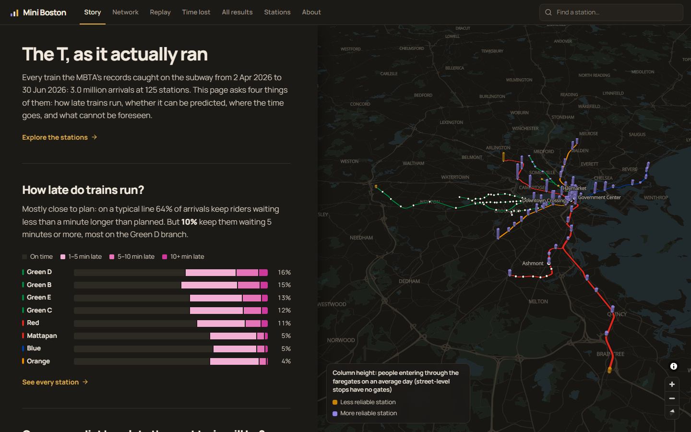

# Mini Boston: the T, as it actually ran

How late Boston's subway runs, whether a train's next-stop delay can be predicted,
and where the network loses time, from 3.9 million MBTA stop records.



## What it found

- A train's delay at its next stop can be predicted to within 16 seconds on
  average, against 49 s for "it stays as late as it is". That holds in a snowy
  winter (18 s against 48 s) and on a later summer (15 s against 47 s).
  One stop ahead, a simple rule (when it left plus the usual travel time) does
  about as well; five stops ahead the model is clearly better (67 s against 77 s).
- Almost all of that comes from one fact: how late the train already is. Weather,
  service alerts and station crowding change the error by less than a tenth of a
  second.
- The network loses about 19,000 train-minutes a day against each stretch's own
  good runs, half of it standing at platforms, in the same places every season.
  The worst single stretch is the last one into Alewife.
- Sudden big delays are mostly unforeseeable: one stop ahead the model flags 27%
  of them, five stops ahead 6%.

## Run it

The app runs straight from a clone (Node.js 20.19+ or 22.12+):

```bash
cd map
npm install
npm run dev
```

Rebuilding the analysis needs Python 3.11–3.13:
`make all` (or `.\make.ps1 all` on Windows). 260 tests run with `make test`.

## More

- [REPORT.md](REPORT.md): the full write-up: data, cleaning, models, evaluation,
  limitations.
- [map/README.md](map/README.md): the app.
- Data: MBTA data provided by MassDOT under its Developers License Agreement;
  weather by [Open-Meteo.com](https://open-meteo.com/) (CC BY 4.0). Not
  affiliated with or endorsed by the MBTA or MassDOT. Details in REPORT.md §3.
- Code: [MIT licence](LICENSE). The licence does not cover the data.
