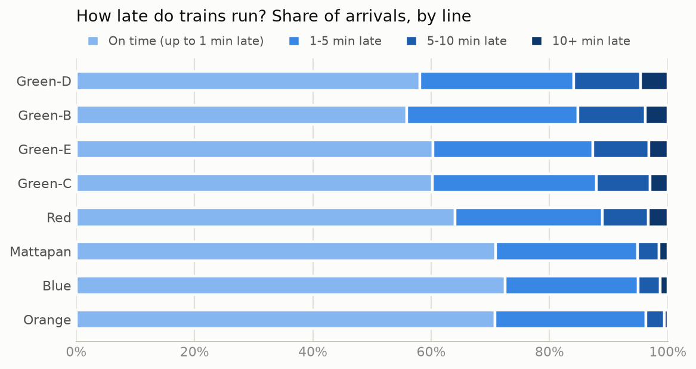
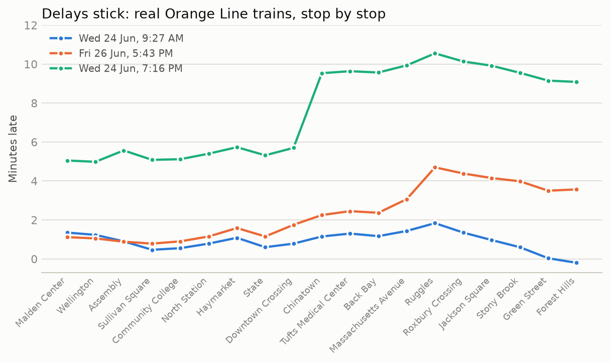
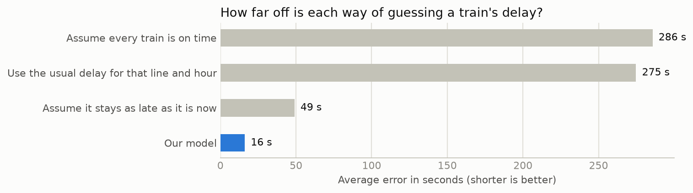
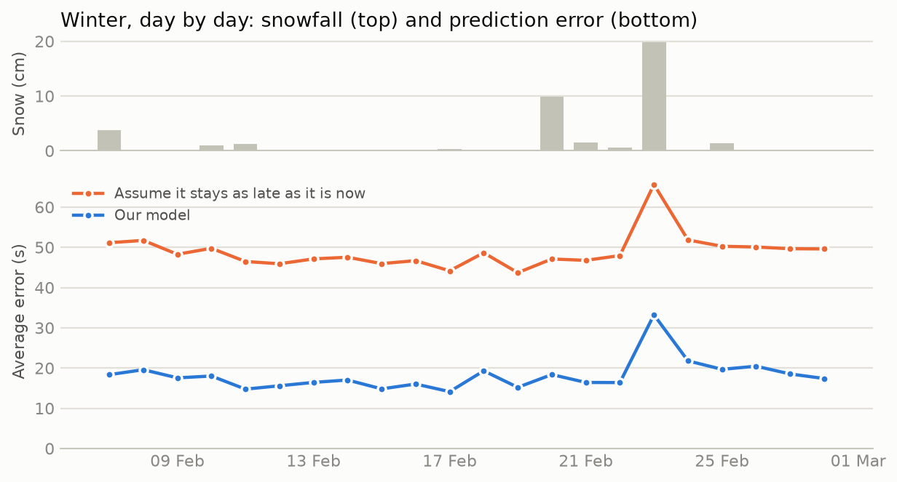
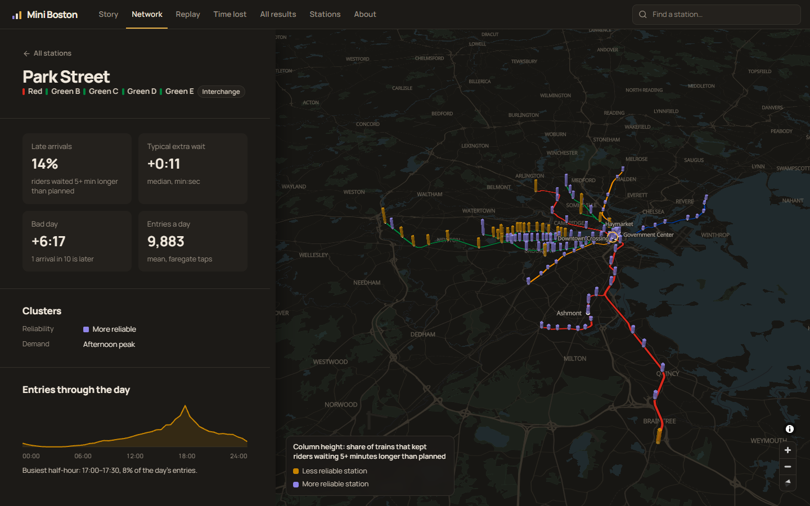
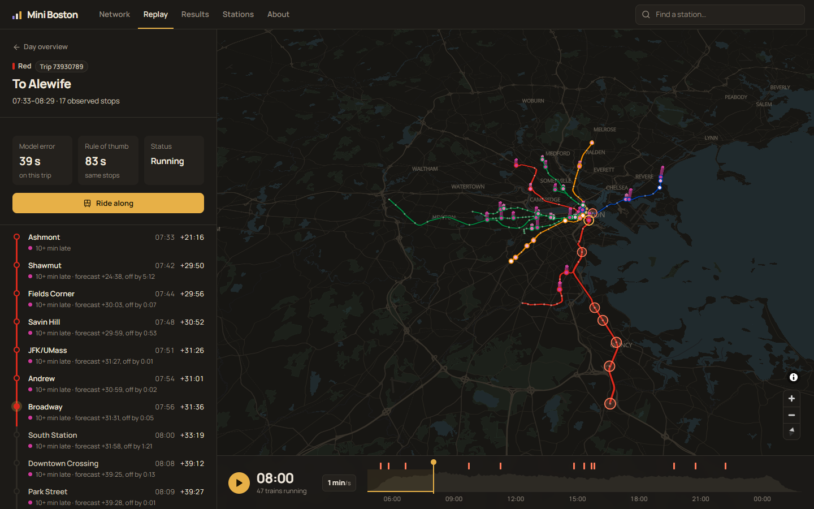
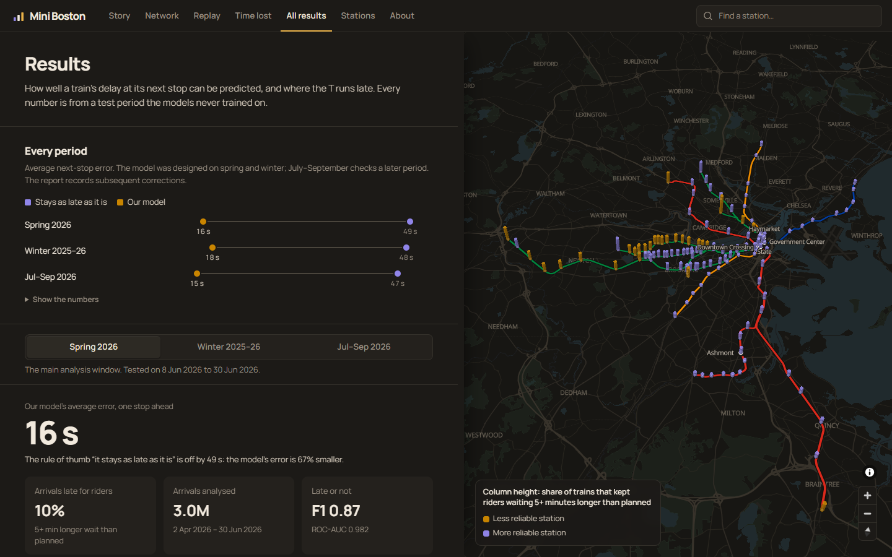
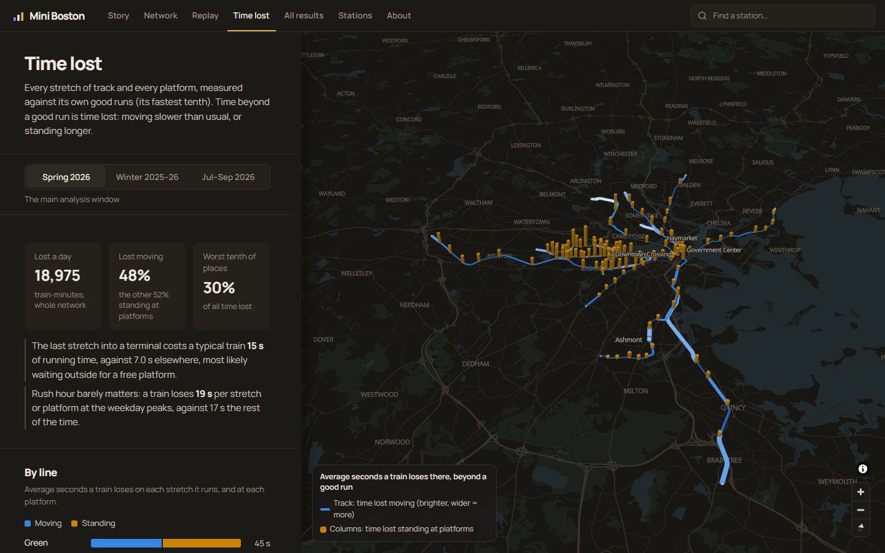

# MBTA Subway Reliability & Ridership Analytics

**CS 506 (Data Science Tools and Applications) — final project**

Predicting when the T runs late, and what kind of stations the network is made of.
This repository implements the full data-science lifecycle — collection, cleaning,
feature extraction, visualisation and modelling — on real MBTA open data.

Two tracks share one dataset builder:

* **Track A — arrival delay.** Predict subway arrival delay in seconds, and
  classify whether a train will be more than 5 minutes late. Then cluster stations
  by how reliably they are served.
* **Track B — demand.** Cluster stations by the *shape* of their ridership through
  the day, and test whether reliability and demand type are related.

**Headline result.** Gradient boosting that predicts *how much delay a train gains
or loses since its last stop* has a mean absolute error of **16.2 seconds**, a
**67% improvement** on delay persistence (49.0 s), steady at 66–69% across four
separate test periods. **One stop ahead it does not beat the textbook transit
baseline**: the time the train left its last stop plus that stretch's usual
running time scores **14.9 s** (§7, *The baseline persistence leaves out*). The
model earns its keep further ahead: five stops out that lookup errs by 79.1 s
against the model's 67.9 s. A model that starts from the lookup and learns only its
correction scores **12.7 s**, better than both, and wins in every backtest window;
it is reported as a candidate, not the headline, because it was designed after
these test scores were seen (§7). **The change model holds in winter too**: on
December–February, storms included, it scores 17.7 s against 48.4 s (63%, and
62–68% in every fortnight). Lateness classification reaches **F1 0.873 / ROC-AUC
0.981**. Ten stops ahead, the model is still 26% better than persistence.

**Checked on a later period.** The frozen pipeline was also run on July–September
2026, after every design choice had been made on spring and winter. It scores
**15.1 s against persistence's 47.0 s (68%)**. The first run on that holdout
found one weakness, isolated corrupt stop records copied forward by the change
target. The cleaning rule that fixes it was set on spring data, and §7
(*Holdout*) reports both runs.

**How the winter run changed the model.** Predicting the delay itself failed in
winter: that model averaged 103 s in the fortnight of the 25 January storm, twice
persistence's error. The cause was not weather but range. On storm days trains
were logged *hours* behind the timetable, beyond anything in training, and a tree
model can only predict values it has seen. Predicting the change since the last
stop removes the cap, and improved spring by 29% as well (§7).

**Headline finding.** Almost all of the predictive power comes from one feature:
the train's delay at its previous stop. Delays are *sticky*: a train that is five
minutes late at one stop is almost exactly five minutes late at the next. Everything
else — weather, mode, service alerts, the schedule itself — is worth an order of
magnitude less. The project also documents a time-index feature whose damage
depended on how early stopping was validated (§7), five defects in the source data
that had been quietly shaping earlier results (§5), and a ridership calculation
that halved the network's busiest stations until it was caught (§8).

**Where the T loses time.** Against each stretch's and platform's own good runs,
the network loses about 17,000–19,000 train-minutes a day, half of it moving and
half standing at platforms, and in the same places every season. The last stretch
into Alewife is the worst per train (76 s lost typically, 4 minutes for 1 train in
10), terminals in general cost twice what other stretches do, and the Green
Line's street-running branches follow. Rush hour barely changes any of it (§8,
*Where the T loses time*).

---

## The project in pictures (no maths needed)

**Open [`reports/story.html`](reports/story.html)** for the whole story in eight
interactive charts, each answering one plain question (hover for exact values).
It is written by `make report`, or on its own by `python -m mbta_ds.cli story`.
Four of the charts, in brief:

**How late do trains run?** Most arrivals are within a few minutes of the
timetable. The Red Line is late most often; the Mattapan trolley keeps closest to
schedule.



**Why can delays be predicted at all?** Because a late train stays late. Each line
below is one real Orange Line train, end to end: whatever delay it has, it mostly
keeps. The one big jump, at Chinatown, is the kind of sudden change nothing
upstream warns about.



**How good are the predictions?** Predicting how late a train will be at its next
stop, the model is off by 16 seconds on average. The best rule of thumb, "it stays
as late as it is", is off by 49.



**Does it hold up in a snowstorm?** Day by day through February 2026: even on the
23 February storm, the model stayed about half as far off as the rule of thumb.



**And all of it in one app, on a 3D map.** [`map/`](map/README.md) is the
project's interface: the network in 3D, with a panel docked beside it for each
view, sized to what the view is for. It opens on the **Story**: the project's
findings as short chapters in plain words, each with one number and one chart,
while the map beside it changes to show each chapter as you scroll (the stations,
a day's trains, where time is lost). **Network** stands each station up as a column: its height is the late
share, bad-day delay or daily entries, and its colour is its reliability cluster.
**Replay** plays back real service days train by train (a spring weekday, the 23
February storm and a holdout day), each train coloured and raised by its
lateness. Select a train to follow it stop by stop, with the model's forecast for
each stop against what happened. The MBTA's own alerts for that day (a disabled
train, shuttle buses, a signal problem) are marked on the timeline, listed while
they are in effect, and ring the stations they name, so you can watch the delays
that follow. **Time lost** colours every stretch of track by the time trains lose
moving there and raises a column at every station for the time they lose standing,
per train or per day, with what winter makes worse. **Results** holds the charts
above and more, for spring, winter and the holdout; hovering a line in a chart
brings it forward on the map. **Stations** is every station in a sortable table.
Run it with `make map` (needs Node.js).










---

## 1. How to build and run the code

Requires **Python 3.11, 3.12 or 3.13** (the pinned wheels stop at 3.13; `make setup`
checks), about **8 GB of RAM** (training peaks near 6 GB) and ~3 GB of disk. Nothing
else — no API key, no manual downloads. Every data source is public or keyless.

Use a fresh virtual environment so the pinned versions don't clash with anything
else installed:

```bash
python -m venv .venv
source .venv/bin/activate      # Windows: .venv\Scripts\activate
make all          # install, fetch data, validate, train, cluster, plot, write the report
```

**The analysis window is pinned** to 2026-04-02 → 2026-06-30 (`END=2026-06-30`), so a
run on any machine, on any later date, studies the same 90 days. `make END=latest all`
follows the newest data every source covers instead.

That is the whole thing. It runs the stages below in order, and when it finishes
**open `reports/report.html`**: every result on one page, readable offline in any
browser, with every table also saved as CSV in `reports/tables/`. On a 16-core
laptop the first run takes roughly 15–20 minutes (the download is ~400 MB; the
training stage alone is ~9 minutes). Individual stages:

```bash
make setup        # install Python dependencies
make data         # download + clean 90 days, build features, validate the data
make live         # poll the MBTA V3 API and record live snapshots (~10 min)
make live-day     # poll until 03:00, the end of the service day
make model        # train the delay models, then the 10+ minute warning and ranges
make model-full   # as above, plus the costly random forest and KNN
make cluster      # cluster stations by reliability and demand (Track B)
make figures      # render interactive HTML figures and static PNGs
make report       # write reports/report.html, reports/story.html and reports/tables/*.csv
make map          # export the map data and open the 3D map (needs Node.js)
make test         # run the test suite (227 tests, no network required)
```

**Reproducing the exact numbers on another computer.** `make setup` installs
`requirements-lock.txt`: every package, including transitive ones, at the exact
version these results were produced with. `requirements.txt` holds the compatible
ranges for development. Rebuilding from the same downloaded data with the pinned
versions was checked to give byte-identical results (§12).

**The winter comparison.** `reports/story.html` shows winter beside spring when the
winter run exists, so build it first to reproduce the published page (it takes the
same time again):

```bash
make RUN=winter END=2026-02-28 all   # kept in data/runs/winter and reports/winter
make all                             # the main run; its story now includes winter
```

Useful knobs:

```bash
make DAYS=180 data        # a longer window ending at END
make END=latest all       # follow the newest data instead of the published window
make RUN=holdout DAYS=89 END=2026-09-27 NO_RIDERSHIP=1 all   # the July–September holdout (§7)
```

**Windows.** `make` is not installed on a stock Windows machine, so `make.ps1`
exposes the same targets:

```powershell
.\make.ps1 all
.\make.ps1 data -Days 180
```

You can also skip `make` entirely and call the pipeline directly:

```bash
PYTHONPATH=src python -m mbta_ds.cli collect --days 90
PYTHONPATH=src python -m mbta_ds.cli all --days 90
```

### Progress output

Long stages report progress so a multi-minute run never looks like a hang. Two
levels are printed: a `[n/total]` counter for the stage as a whole, and one per
inner loop with the running metric and an ETA.

```
INFO mbta_ds.progress: train stage: 0/7
INFO mbta_ds.progress: [5/7] regression models decision_tree  (elapsed 22s, eta 9s)  MAE 29.8s  R2 0.971
INFO mbta_ds.progress: [2/4] walk-forward backtest 20260520..20260602  (elapsed 36s, eta 36s)  MAE 23.3s vs 48.7s
INFO mbta_ds.progress: [3/4] prediction horizon 5 stop(s) ahead  (elapsed 2m 40s, eta 53s)  persistence 104.5s  own 72.5s  +others 71.4s
```

Counting is built on the logging framework (`src/mbta_ds/progress.py`) rather than a
progress-bar dependency, so the output lands in the same stream as everything else
and is captured by a redirect. The same `Progress` helper is reused by every slow
loop: model fitting, ablations, the k-sweep in clustering, feature joins, and the
bulk downloads. Raise verbosity or dial the interval with `Progress(log_every=...)`.

### Environment and API key

The project runs with **no API key at all**. The bulk historical data is public,
and the live collector stays under the anonymous rate limit (3 requests/minute
against a 20/minute allowance).

A key is optional and only raises the rate limit:

```bash
cp .env.example .env      # then put your key in MBTA_API_KEY
```

`.env` is gitignored and never committed. Keys are free from
<https://api-v3.mbta.com/portal>.

### What gets produced

| Path | Contents |
|---|---|
| `data/processed/trips_clean.parquet` | tidy trip-stop table with computed delay |
| `data/processed/clean_ledger.csv` | how many rows each cleaning step removed |
| `data/processed/validation.csv` | every data-validity check, its value and limit |
| `data/processed/features.parquet` | the leakage-safe modelling matrix |
| `data/processed/model_comparison.csv` | every regression candidate scored |
| `data/processed/ablation.csv` | test MAE per feature group |
| `data/processed/trend_diagnostic.csv` | the time-trend experiment |
| `data/processed/station_clusters.parquet` | per-station cluster assignments |
| **`reports/story.html`** | **the results in plain words and eight charts — start here if you are not technical** |
| **`reports/report.html`** | **every result on one self-contained page — start here for the details** |
| `reports/tables/*.csv` | each results table, with readable column names |
| `reports/figures/*.html` | interactive figures (open in a browser) |
| `reports/figures/*.png` | static versions, embedded in the report |

---

## 2. Project goals

Stated so they can be measured:

1. **Predict subway arrival delay** at a given stop to within a mean absolute
   error materially below the delay-persistence baseline, evaluated on a future
   time period never seen in training.
2. **Classify lateness** (>5 minutes behind schedule) with F1 and ROC-AUC above
   that same baseline.
3. **Quantify which data sources actually help**, by ablating feature groups
   rather than asserting their value.
4. **Cluster the 125 subway stations** into interpretable reliability and demand
   types, and test whether the two typologies are related.

All four are met, and the fourth produces a **null result that is reported as
such** (§8). A fifth question was added once they were answered:

5. **Find where the network loses time**, moving or standing, and whether those
   places change with the season (§8, *Where the T loses time*).

---

## 3. Data sources

Five independent sources. Every endpoint below was verified live during
development; nothing is assumed to exist.

| # | Source | What it provides | Access |
|---|---|---|---|
| 1 | **LAMP subway on-time performance** | One Parquet file per service date, one row per `trip_id` × `stop_id`, with the *observed* stop timestamp **and** the *scheduled* arrival/departure time, plus dwell time and headways. Coverage 2019-09-15 → present. | `performancedata.mbta.com` — public, no key |
| 2 | **MBTA V3 API** | Live `/predictions`, `/vehicles`, `/alerts`; also station names and coordinates for the map, which the static table lacks. | `api-v3.mbta.com` — key optional |
| 3 | **Gated station entries** | Faregate validations per station per 30-minute period. The demand signal. | ArcGIS FeatureServer — public |
| 4 | **Open-Meteo historical archive** | Hourly temperature, precipitation, snowfall, wind, humidity for Boston. | `archive-api.open-meteo.com` — keyless |
| 5 | **LAMP alerts archive** | Archived GTFS-Realtime alerts with `cause`, `effect`, `severity`, text, and affected route/stop. | `performancedata.mbta.com` — public |

**Why LAMP rather than the live API for training?** The V3 API is a *snapshot*: it
tells you where trains are now, not how late they were on 400 previous days. The
LAMP archive is the retrospective record, and pairing observed against scheduled
times is what makes delay a *label* rather than an inference. The live API is still
used, for two things it alone can do: station coordinates, and the live collector.

### Two coverage traps, both handled in code

* **The ridership service is shorter than the performance archive.** Probing it
  showed coverage ending 2026-06-30 while LAMP ran to 2026-09-27. Rather than
  hard-code dates, `collect_ridership.coverage()` queries the live bounds and the
  collection stage intersects all sources into **one shared window**, persisted to
  `data/analysis_window.json`. Every later stage reads that file, so no stage can
  silently disagree about which dates are under analysis. This window is
  **2026-04-02 → 2026-06-30 (90 service days)**.
* **56 of 125 stations have no gated entries at all.** Green Line surface stops
  west of Kenmore and parts of the Green Line Extension have no faregates. That
  absence is informative, so it is flagged (`demand_missing`) rather than imputed
  to zero.

### Data volumes actually collected

| Source | Volume |
|---|---|
| Performance records | 3,906,187 rows across 90 daily Parquet files |
| Ridership | 282,237 half-hourly rows → 6,964 station-days (72 gated stations) in the window, plus the 14 days before it, fetched so the lagged demand features are complete from day one |
| Weather | 2,160 hourly rows |
| Alerts archive | full GTFS-Realtime alert history |
| Station coordinates | 125 stations from the V3 API |
| **Live capture** | **5 polls: 3,932 predictions, 281 vehicle positions, 50 alerts** |

### Data licences and attribution

This project is not affiliated with or endorsed by the MBTA or the Massachusetts
Department of Transportation (MassDOT). It uses no MBTA or MassDOT logos.

| Data | Provider | Licence | Where it is used |
|---|---|---|---|
| Subway performance records (LAMP), the alerts archive, the V3 API (stations, track shapes, line colours, live predictions), and the MBTA's prediction-accuracy file | MassDOT / MBTA | [MassDOT Developers License Agreement](https://www.mass.gov/massdot-developers-data-sources) (13 November 2009) | Everything: cleaning, models, clustering, the app |
| Gated station entries | MBTA ([open data portal](https://mbta-massdot.opendata.arcgis.com/)) | CC0 1.0 (public domain dedication), as stated on the dataset | Demand features and demand clusters |
| Hourly weather | [Open-Meteo.com](https://open-meteo.com/) | [CC BY 4.0](https://creativecommons.org/licenses/by/4.0/) | Weather features; winter storm days |
| Map tiles and base-map data | [OpenFreeMap](https://openfreemap.org/), © [OpenMapTiles](https://openmaptiles.org/), data © [OpenStreetMap](https://www.openstreetmap.org/copyright) contributors | ODbL (OpenStreetMap data) | The app's base map; attributed on the map |

What the MassDOT agreement asks, and how this project meets it:

- It grants a non-exclusive, limited and revocable right to use, reproduce and
  redistribute the data, and to combine it with other data. MassDOT can change or
  revoke the terms at any time.
- MassDOT must be acknowledged as the provider of the data. All MBTA data in this
  project is provided by MassDOT and the MBTA, and remains theirs.
- A user may not claim ownership of the data, present themselves as MassDOT or its
  partner, use its logos or trademarks, misrepresent the data, or offer guarantees
  about it. The data comes "as is". This project's analysis of its quality (§5) is
  a description, not a guarantee.

The data files committed here (`map/public/data/`, the tables in `reports/`) are
derived from MBTA data and stay under the MassDOT agreement. Any licence chosen for
this repository's code does not extend to them.

Weather: "Weather data by [Open-Meteo.com](https://open-meteo.com/)", under
CC BY 4.0. It was aggregated to hourly Boston values and joined to train arrivals.
Open-Meteo's historical archive draws on reanalysis that includes the Copernicus
Climate Change Service's ERA5, which Open-Meteo credits on its
[licence page](https://open-meteo.com/en/licence).

TransitMatters' public data was queried once, for an independent check of this
project's timestamps (§5). None of it is redistributed here.

---

## 4. Repository structure

```
.
├── README.md                  ← this document (the final report)
├── makefile                   ← required build entry point
├── make.ps1                   ← Windows equivalent (no `make` needed)
├── requirements.txt           ← compatible version ranges
├── requirements-lock.txt      ← exact versions, for byte-identical reproduction
├── pytest.ini                 ← puts src/ on the path so `pytest` just works
├── .env.example               ← copy to .env to add an API key (optional)
├── src/mbta_ds/               one module per pipeline stage, in run order:
│   ├── config.py              paths, endpoints, window manifest, .env loader
│   ├── http.py                one retrying session + atomic cached downloads
│   ├── progress.py            [n/total] counters with elapsed time and ETA
│   ├── collect_lamp.py        performance archive, stops table, alerts
│   ├── collect_ridership.py   gated entries (coverage probe + parallel paging)
│   ├── collect_weather.py     Open-Meteo hourly weather
│   ├── collect_v3.py          live poller, station coordinates
│   ├── clean.py               delay computation and the ten cleaning rules
│   ├── features.py            the leakage-safe design matrix, any horizon
│   ├── validate.py            data-validity checks, all against the analysis window
│   ├── model_delay.py         Track A: models, ablation, backtest, horizons
│   ├── model_tail.py          10+ minute early warning and prediction ranges
│   ├── cluster_stations.py    Track B: reliability and demand clustering
│   ├── extras.py              supporting analyses behind the narrative claims
│   ├── segments.py            where the T loses time: per stretch and platform
│   ├── crosscheck.py          independent comparison with TransitMatters (network)
│   ├── compare_mbta.py        our accuracy by the MBTA's countdown-clock rule (network)
│   ├── incidents.py           minute-level alert features, and the test of them
│   ├── viz.py                 interactive Plotly HTML + matplotlib PNG
│   ├── report.py              reports/report.html + reports/tables/*.csv
│   ├── story.py               reports/story.html: plain-language charts
│   ├── export_map.py          network, replay days and results for the app in map/
│   └── cli.py                 `python -m mbta_ds.cli <stage>`
├── tests/                     227 tests, network-free, synthetic fixtures
├── map/                       the 3D map (React + MapLibre); data in map/public/data
├── reports/                   everything a person reads (regenerated by `make all`)
│   ├── report.html            all results on one offline page
│   ├── story.html             the results for non-technical readers
│   ├── tables/                each results table as CSV
│   └── figures/               interactive HTML and static PNG figures
└── data/                      raw downloads + processed tables (gitignored, regenerable)
```

---

## 5. Data cleaning

Delay is computed as **observed stop time − scheduled arrival time**, anchored the
way GTFS defines its times, at **noon minus 12 hours** of the service date:

```
delay_seconds = stop_timestamp − (noon_local(service_date) − 12 h + scheduled_arrival_time)
```

**The timetable is coarse.** Every scheduled time in the spring window (all
3,231,016 rows) falls on a whole minute, and the scheduled arrival always equals
the scheduled departure: there is no planned stop time. So each "delay" carries up
to ±30 s of rounding, and time spent at the platform is folded into the plan's running
time. This does not inflate the prediction errors in
§7: the models predict arrival time minus the same rounded schedule they are given,
so the rounding is known, not noise. It does blur the thresholds: "5 minutes late"
means somewhere between 4.5 and 5.5 minutes behind the unrounded plan.

That anchor is local midnight on every day except the two DST transitions, where it
is 23:00 the evening before (spring forward) or 01:00 (fall back). An earlier version
anchored at midnight: harmless in both published windows, which contain no DST day,
but checked against the real archive it put every delay on 8 March 2026 off by
−3,600 s (median −3,616 s instead of −16 s) and on 2 November 2025 by +3,600 s,
enough for the mismatched-trip rule to drop the whole spring-forward day. The anchor
also makes the MBTA's 3 AM service-day boundary work without special cases:
post-midnight trips carry GTFS times above 86400 seconds (23,971 of 316,427 rows in
a five-day sample did). Both DST days are asserted by the tests.

### The rules, and the evidence behind them

Every rule came from inspecting real data, not from assumption:

**1. Exclude `ADDED-*` and `NONREV-*` trips — 652,192 rows (16.7%).**
`trip_id` has three namespaces. Regular numeric trips have a textbook delay
distribution. `ADDED-*` trips are created at runtime and `NONREV-*` trips are
non-revenue moves; **neither has a meaningful entry in the published schedule**, so
their apparent "delay" is an artefact of a bad match:

| namespace | rows | median delay | mean delay |
|---|---|---|---|
| numeric (kept) | 259,343 | **+63 s** | +153 s |
| `ADDED-*` | 47,156 | −9,817 s | −13,198 s |
| `NONREV-*` | 1,494 | −18,734 s | −22,519 s |

They are excluded not because they are outliers but because the quantity being
predicted is *undefined* for them. Keeping them would have dragged mean delay to
−2,001 s and made 13% of rows look absurd.

**2. Drop rows missing an observation or a schedule — 11,837 rows (0.30%).**
A delay needs both sides of the subtraction.

**3. De-duplicate on `(service_date, trip_id, stop_id)` — 3,028 rows (0.08%).**
Critically, the key **includes `service_date`**: `trip_id` is reused across days
(2,123 of 13,305 trip ids appear on more than one date), so grouping on `trip_id`
alone silently mixes days. An early version of this analysis did exactly that and
produced nonsense lag features — see the tests in `test_features.py` that now pin
the behaviour down.

**4. Flag, do not delete, implausible values.** Delays beyond ±1 hour (0.29% of
rows) and dwell times beyond 30 minutes are flagged (`delay_outlier`,
`dwell_implausible`) rather than dropped, so the report can quantify the tail the
models are fighting instead of hiding it. Dwell outliers are set to null.

**5. Resolve station names.** The LAMP data dictionary says `parent_station` holds
a stop *name*; it actually holds a stop **id** (e.g. `place-alfcl`). Names are
joined from the static stops table. That table carries every schedule version since
2019 (750 of them), and stations get renamed, so the **latest** version's name is
used. Taking the first row per id, as an earlier version did, produced 2019 names
("Packards Corner", "Science Park") that no longer match the V3 API, and silently
dropped three stations from the map.

**6. Order each trip by scheduled time, not `stop_sequence` — 3,830 trips reordered.**
`stop_sequence` is not a reliable order. On 3,830 trips (2%), mostly Green-E into
Heath Street, the trip's **final** stop is labelled `stop_sequence == 1`. Sorting by
it put the end of the trip first, so the next stop's "previous delay" was really
the delay at the *end* of the trip — information from the future. The scheduled
arrival time is monotone by construction, and ordering by it removes every
schedule inversion (3,907 → 0) and 65% of the apparent time-travel (5,703 → 1,992).
The stop numbers also step by 10 on most lines (up to 710 on a 32-stop trip), which
had made `fraction_through_trip` range up to 670 instead of 0–1.

**7. Keep one row per scheduled visit — 483 rows.** At Kenmore, Ashmont and
Mattapan, one arrival is sometimes recorded under two platform ids. The second copy
became its own "previous stop", handing the model the answer.

**8. Drop whole trips running more than 30 minutes early — 6,361 rows.**
Some trips sit at a steady offset of about an hour *ahead* of schedule at every
stop (one Green-D trip: −4,051 s at Kenmore, −4,141 s at Riverside, varying by
under a minute). On a line where trains cannot overtake, a trip 30 minutes early
would have passed the 3–5 trains scheduled in front of it. These are vehicles
matched to the wrong timetable entry, so their "delay" is undefined, like rule 1.
Trips 5–15 minutes early are kept: they are common on Green-E out of Heath Street,
where departures are not held to the clock (§8). Very *late* trips are kept too; they cluster
on known disruption days, and a late train does not need to overtake anything.
The rule runs after rule 11, so a trip's median is judged on its real stops.

**9. Flag arrivals timestamped before the previous stop — 1,358 rows (0.04%).**
A train cannot reach stop *k*+1 before stop *k*. These rows (`time_inconsistent`)
stay in the table but are not used as delays.

**10. Split trips where the train changes, and don't score each train's first stop
— 188,127 rows.** Trains reach the origin platform and wait: the median "delay"
there is **−190 s**, 15% of origins look more than 10 minutes early, and the model's
error on them was **307 s** (6% of test rows, 35% of all error). On 300 Green Line
trips, a *different vehicle* finishes the trip (the record switches trains at, say,
Copley). The delay jumps a median 68 s at that hand-over, against 24 s between
ordinary stops, so each vehicle's stretch is its own "run" and lag features never
reach across trains. The first stop of each run is kept as the source of the next
stop's lag features, but `clean.is_arrival` excludes it wherever delay is
*measured*: model targets, clustering and figures. Left in, origins also made
terminals look punctual (§8). (A further 1,328 trips change their recorded
`stop_count` partway through with the *same* train; that is bookkeeping in the
source, the delays run on smoothly, and those trips are left whole.)

**11. Drop isolated stops more than 30 minutes off both neighbours — 1,270 rows
(0.04%).** A real hold-up raises a train's delay and it *stays* raised at the next
stop (1,539 such steps in spring). A stop more than 30 minutes away from both
neighbouring stops of its run, while those neighbours agree to within 10 minutes,
is a bad record instead: on 5 September a Red Line train was logged 3.4 hours early
at one stop and on time at the next. At a run's ends the one neighbour and the stop
beyond it are used. Left in, the change model copies the bad stop forward as "the
previous delay" and misses by hours (§7, *Holdout*). The thresholds were set on
spring data; `validate` checks that none remain.

### Result

Delay statistics describe genuine arrivals (rules 9 and 10 excluded).

| | |
|---|---|
| Raw rows | 3,906,187 |
| **Clean rows** | **3,231,016** |
| Arrival rows (delay measured) | 3,041,531 |
| Median delay | **+56 s** |
| Mean delay | +129.0 s |
| 5th–95th percentile | −421 s → +831 s |
| Share more than 5 min late | 21.4% |
| Flagged as outliers (beyond ±1 h) | 0.23% |

*(`extras` stage.)* **Every derived value was re-derived independently** on 2,000
random feature rows, using different code: delay from the raw timestamp with
Python's own `zoneinfo` and the GTFS anchor, the previous-stop delay by walking
each run in scheduled order, and the weather looked up by hand for the prediction
hour. All 2,000 match exactly on all three, in both seasons.

**Where values are missing, and why.** The gaps in the arrival table are
structural, not errors. Branch headways are missing only on lines with no
branches (100% on Blue, Orange and Mattapan; under 1% elsewhere). Dwell time is
missing at the trip origin (99.8%), where there is no previous dwell. In the
feature table, `station_entries_lag7` is missing for the 32% of rows at ungated
stations, flagged by `demand_missing`. The boosted models take every gap as
"missing" natively, and the others impute a training-set median inside the
pipeline.

That distribution — a median within a minute of schedule, a long right tail — is
what a functioning transit system looks like, which is the sanity check that the
arithmetic is right.

### Validation

`make data` ends with a `validate` stage (`src/mbta_ds/validate.py`) that runs **30
checks** across the delay table, feature table, ridership and weather, and fails
the build if a hard one fails. Coverage is checked against the analysis window
itself, not the dates that happen to be present: every window date in the delay
table and the ridership, no date outside the window, weather through the last
service day's small hours. Also: no schedule running backwards inside a trip, no duplicate visits, no trip
matched to the wrong timetable, recorded travel time equal to arrival minus
departure (100% of rows), weather hourly with no gaps, humidity within 0–100%, no
target column among the features, no isolated off-trip stop left. All 30 pass.
One *informational* check counts route-days running below 60% of their usual
volume: **79**. Those are planned shutdowns, visible in the data — the whole Green
Line on 30 May–5 June, Green-C on 6–17 May, and the Red Line at 5–20% of normal on
several weekends. They are real service changes, not errors, so they are reported
rather than removed.

**Independent cross-check against TransitMatters.** TransitMatters derives travel
times from the same MBTA archive with its own code. `python -m mbta_ds.cli
crosscheck` (optional; it calls their web API, so it is not in `make all`) takes an
8-stop stretch of the Red, Orange and Blue lines on three test-period days and
matches each of their trips to ours by arrival time:

* **1,724 of their 1,911 trips match ours, with a median arrival-time difference of
  0 seconds** on all nine line-days, and median end-to-end travel times within 8 s.
* **Of the 187 that do not, 171 are `ADDED-*` trips** found in the raw archive at
  the same stop within a minute, the unscheduled service this project deliberately
  leaves out (§11). The remaining 16 (0.8%) are unexplained.

Loading, timezone handling and cleaning therefore reproduce an independent
pipeline's timestamps exactly.

**What the checks caught on the winter window.** Re-running on December–February
(`make RUN=winter END=2026-02-28 all`) tripped two checks that had never fired on
spring data. Both turned out to describe the world, not a bug, and are now reported
rather than blocking the build:

* **Three service dates (4, 10 and 12 December) are empty in the MBTA's own
  archive.** The check now separates "dates the source never had" (informational)
  from "dates the pipeline lost" (still a hard failure, still zero).
* **0.66% of winter arrivals are more than an hour off schedule**, above the spring
  ceiling. They cluster on storm days (§7, *Winter*), so the check reports the share
  instead of failing.

---

## 6. Feature extraction

The central discipline is **causal ordering**: a feature for the arrival at stop
*k* may only use information that exists before the train reaches stop *k*.

* Lag features come from the **previous stops of the same trip**, in scheduled-time
  order (§5 rule 6), produced with `groupby(["service_date", "trip_id"]).shift(1)` —
  never from the current or later rows, and never across a day boundary.
* **Targets are genuine arrivals.** Trip origins and impossible timestamps (§5
  rules 9–10) feed the next stop's lags but are never themselves predicted, so every
  target row has a previous-stop delay.
* Demand is joined from a **lagged 7-day rolling window** over *calendar* days,
  never the same day's total, which is only known once the day is over.
* **Alerts count only from the first full hour after they are known**, and are
  matched to the hour of the *prediction moment*, not the target's scheduled hour
  (which, several stops ahead, can lie after alerts raised since). The archive's
  alerts are reactive: the median gap between creation and the start of the active
  period is zero, and 9.6% of active periods start *before* the alert was created
  (1.3% by over 30 minutes), so an alert is known from the later of the two.
  Bucketing an alert into the hour it started would let one raised at 08:50 inform
  an 08:10 arrival. Elevator and escalator outages (`ACCESSIBILITY_ISSUE`, ~93% of
  subway alerts) are excluded because they say nothing about train running.
* **No target encoding is done ahead of time.** Categorical identifiers reach the
  model as raw categories, and every imputation, scaling and encoding step lives
  inside a scikit-learn `Pipeline` that is fit on training rows only.
* Weather is joined on the hour of the **prediction moment** (Open-Meteo's hourly
  precipitation is the total for the hour *before* its timestamp, so nothing from
  after the prediction is used). It is still observed, reanalysed weather, a
  **nowcast rather than a forecast**, as the limitations say.

**Ordering bug caught during development.** The first version subsampled rows
*before* computing lags. That corrupted every lag feature — `shift(1)` returned the
previous *surviving* stop rather than the previous stop — and inflated the missing
rate from 5.8% to 29%. The pipeline now computes row-wise features on the full clean
table and subsamples afterwards. The reason is documented in `features.build`.

| Group | Features |
|---|---|
| `schedule` | `stop_sequence`, `stop_index`, `scheduled_seconds_of_day`, `scheduled_hour`, `scheduled_elapsed_seconds`, `scheduled_travel_time`, `scheduled_headway_branch`, `scheduled_headway_trunk` |
| `propagation` | `prev_delay_1`, `prev_delay_2`, `prev_dwell_seconds`, `prev_travel_time_seconds`, `prev_headway_seconds`, `delay_trend`, `scheduled_seconds_ahead` |
| `calendar` | `day_of_week`, `is_weekend`, `is_peak` |
| `demand` | `station_entries_lag7`, `station_entries_trend`, `demand_missing` |
| `weather` | `temperature_c`, `precip_mm`, `snowfall_cm`, `wind_kph`, `humidity_pct`, `is_precip`, `is_snow`, `weather_missing` |
| `alerts` | `route_alerts_active`, `route_alert_severity_max` |
| `network` | `leader_delay`, `leader_age_seconds`, `line_late_share_15m`, `line_arrivals_15m` |
| `vehicle` | `vehicle_prev_trip_delay`, `vehicle_layover_seconds` (how the same train finished its previous trip) |
| `categorical` | `route_id`, `trunk_route_id`, `direction_id`, `station_name` |

**The `network` group: other trains on the line.** Delay does not only travel along
a trip; it travels down a line, because trains queue behind each other. For every
arrival the model predicts, these features describe the line **as it stood at the
moment of prediction** — when the train left its previous stop — and nothing later:
the delay of the last train to reach the target station and how long ago it did,
and the share of the line's arrivals in the previous 15 minutes that were more than
5 minutes late. Branches that share track count as one line (every Green train
queues at Park Street). The lookups are `merge_asof` joins that only look strictly
backwards in time, and the tests pin down that a train arriving *after* the
prediction moment is never used.

**Prediction horizon.** `features.build(horizon=k)` builds the same table for
predicting delay *k* stops ahead: every `prev_*` feature then describes the stop *k*
back, `scheduled_seconds_ahead` is the scheduled time still to run, and the network
features are taken at the moment the train left that stop. §7 uses this to ask how
far ahead delay can be predicted.

Groups are declared in code (`features.FEATURE_GROUPS`) so the trainer can ablate
them declaratively, and the build fails loudly if a declared feature is ever not
produced — a guard added after `scheduled_headway_trunk` was silently missing from
the download list. `days_since_window_start` is still built, but only for the
diagnostic in §7. It is deliberately **not** a model feature, for the reason §7
explains.

**Modelling matrix:** 3,041,531 rows × 41 features (37 numeric, 4 categorical) — every predictable arrival in the
window, built in about 20 seconds. The trainer fits on a seeded sample of 450,000
earlier-period rows, **stratified by service date** so every day is represented, and
scores on *every* later arrival. An earlier version sampled 600k rows before
splitting, so its test set was a sample too, and results moved by a few tenths of a
second whenever the sample was redrawn.

---

## 7. Track A — modelling delay

### Evaluation design

* **Temporal split, never random.** Train on the earlier 75% of *service dates*,
  test on the later 25%. A random row split would put some stops of a trip in train
  and others in test, leaking that trip's own delay path across the boundary. It
  also matches the question a rider asks: given what happened up to yesterday, what
  happens tomorrow?
* **Every test arrival is scored.** Training uses a date-stratified sample; the test
  set is never sampled.
* **Three baselines always reported**, including **delay persistence** — just
  predict the previous stop's delay. Beating persistence is the real bar here, and
  it is not automatic.
* **Several test periods, not one** (the walk-forward backtest below), so a result
  cannot hinge on which weeks happened to be held out.

| | |
|---|---|
| Cutoff | 2026-06-07 |
| Train | 450,002 rows sampled from 2026-04-02 → 2026-06-07 |
| Test | **all 871,779 arrivals**, 2026-06-08 → 2026-06-30 |

Boosted models stop early on the **latest 10% of their training days**, not a random
10% of rows. A random split puts stops of one trip on both sides and flatters the
validation loss (§7, *time trend*, shows what that hid).

### Regression: predicting delay in seconds

| Model | MAE (s) | RMSE (s) | R² | Bias (s) |
|---|---|---|---|---|
| **Gradient boosting on the change since the last stop** | **16.2** | **60.7** | **0.984** | −5.5 |
| Gradient boosting, absolute-error loss | 22.8 | 89.5 | 0.966 | −4.8 |
| Decision tree | 28.8 | 69.7 | 0.979 | −0.0 |
| Gradient boosting, squared-error loss | 31.3 | 126.2 | 0.933 | +4.0 |
| Ridge regression | 40.3 | 87.2 | 0.968 | +0.6 |
| Gradient boosting correcting the running-time lookup (candidate, §7) | 12.7 | 54.9 | 0.987 | −6.1 |
| *Baseline: departure + usual running time* | *14.9* | *68.3* | *0.980* | *−8.5* |
| *Baseline: persistence* | *49.0* | *124.4* | *0.935* | *−21.6* |
| *Baseline: route × hour mean* | *274.6* | *466.2* | *0.082* | *−25.2* |
| *Baseline: predict on time* | *285.7* | *507.5* | *−0.088* | *−144.3* |

The headline model is **fixed in advance** (`model_delay.HEADLINE_REGRESSOR`), not
chosen as whichever candidate scores best on the test period, which would make its
test score an optimistic, selected estimate. Every candidate is still reported.

**Goal 1 met against persistence (16.2 s vs 49.0 s), but not against the
run-time baseline (14.9 s).** The two naïve baselines are *actively harmful*
(R² ≈ 0): subway delay is not explained by route and hour at all.

**The baseline persistence leaves out.** The prediction is made when the train
leaves its previous stop, and the model is told how long it dwelt there, so it
effectively knows the departure time. What remains unknown is one stretch of
running time (a median of about 70 s). Persistence ignores the departure, and it
is worst at a run's second stop: trains wait at the origin, so "as late as at the
last stop" misses by 298 s there (6% of test arrivals, 37% of its error). The
standard transit rule, *departure time + the median running time to this stop in
training* (`model_delay.RunTimeRegressor`), uses the same information with no
learning at all and scores 14.9 s. The model is better on ordinary stops (13.2 s
against 14.7 s) but much worse at a run's second stop (64.2 s against 17.6 s),
because the source records no dwell at the origin, so the model never learns
when the train left it (`error_analysis.by_run_start` in `model_metrics.json`).
The lookup is now a standing baseline, reported by `make all` in the backtest
and horizon tables too; the backtest, horizon and winter tables below predate it.

**Correcting the lookup instead of persistence.** `hist_gradient_boosting_run_time`
(`model_delay.RunTimeChangeRegressor`) starts from the lookup and learns only the
correction, with the lookup as an extra input. The lookup's training values are
cross-fitted by service date, so the correction never learns from medians that
already contain its answers. On the spring split it scores **12.7 s**, beating
the lookup at a run's second stop (16.1 s against 17.6 s) and on later stops
(12.5 s against 14.7 s). It is reported as a candidate, not made the headline:
it was designed after seeing these test scores, and the July–September holdout
has already been used once (§7, *Holdout*). Promoting it needs a period neither
has seen, such as October 2026 (§14).

**Predict the change, not the level.** The headline model is the absolute-error
boosted model below with one change: its target is the delay *gained since the last
stop* (`delay − prev_delay_1`), and the previous stop's delay is added back to its
prediction (`model_delay.ChangeRegressor`). Same features, same learner, 22.8 s →
16.2 s. Two reasons. A tree predicts a constant per leaf, so predicting the delay
itself means spending most of its leaves re-learning "same as the last stop" at
every delay level; predicting the change, all of them go to what actually varies.
And a tree can never output a value outside the range it was trained on. That cost
little in spring but broke the model in winter (§7, *Winter*), where it could not
follow trains logged hours behind the timetable.

**Train on the metric you are scored on.** The same boosted model drops from 31.3 s
to 22.8 s simply by minimising absolute rather than squared error. Squared error
chases the rare 30-minute meltdowns at the expense of the typical arrival. The
decision tree, which fits large delays more closely, has a far lower RMSE than
either level model. The absolute-error models have a negative bias because they
predict the typical (median) arrival rather than the mean, which the long right
tail pulls upwards.

**History: these numbers are not comparable with earlier versions of this report**
(51.1 s vs 73.5 s), because the test set changed, each time by removing rows whose
"delay" was not a real delay, and finally by scoring every test arrival instead of
a sample. Measured step by step on the versions of the time:

| Step | MAE (s) |
|---|---|
| Earlier model, all test rows | 51.1 |
| Earlier model, genuine arrivals only (origins removed, §5 rule 10) | 34.4 |
| Same arrival rows (trip order fixed, MAE loss, native missing values) | 26.4 |
| Mismatched trips also removed (§5 rule 8) | 24.1 |
| Runs split at vehicle hand-overs (§5 rule 10); a new 600k sample | 24.4 |
| `network` features added; trained on 450k rows, **all** test arrivals scored | 23.2 |
| Predicting the change since the last stop | 16.9 |
| Isolated off-trip stops removed, early stopping on the latest days, `stop_count` out | **16.2** |

### Is it overfitted?

Overfitting means learning the training days by heart instead of how trains
behave, so the model does well on data it has seen and badly on data it has not.
Five checks say this model is not:

* **Training and test error are close.** The headline model errs by 14.4 s on its
  own training arrivals and 16.2 s on the later test weeks; the lookup-correcting
  model 11.3 s and 12.7 s. A model that memorised would show a far larger gap.
* **The test weeks always come after the training weeks** (§7, *Evaluation design*), so no
  test day, and no stop of a test-day trip, is ever seen in training.
* **Four separate test fortnights agree** within 2.4 s (the backtest below), and
  so do the winter fortnights, storms included.
* **Each season's model works on the other** (§7, *Winter*), losing at most 1.4 s.
* **A later, untouched period agrees**: July–September, run after the design was
  frozen (§7, *Holdout*).

Model choices were still made while looking at test scores, which makes those
scores slightly optimistic; that is what the holdout, and October (§14), are for.

### Does it hold on other weeks? The walk-forward backtest

The model is refit four times, each time on everything before a two-week window,
and scored on that window. The absolute-error model predicting the delay itself is
refit alongside it, and so are the running-time lookup and the model correcting it:

| Test window | Training days | Arrivals scored | Persistence MAE (s) | Absolute-target model (s) | Change model (s) | Improvement | Lookup (s) | Lookup + correction (s) |
|---|---|---|---|---|---|---|---|---|
| 6 May – 19 May | 34 | 439,890 | 49.4 | 24.2 | 15.4 | 69% | 12.6 | 11.3 |
| 20 May – 2 Jun | 48 | 418,291 | 48.1 | 24.1 | 14.9 | 69% | 12.6 | 11.3 |
| 3 Jun – 16 Jun | 62 | 440,983 | 49.9 | 26.4 | 17.2 | 66% | 15.0 | 13.3 |
| 17 Jun – 30 Jun | 76 | 536,824 | 48.4 | 21.8 | 15.4 | 68% | 14.3 | 12.8 |

**The improvement is steady at 66–69% in every window**, including the first, trained
on only 34 days. The headline is not the product of one convenient test period.
The lookup beats the change model in all four windows, and the model correcting
the lookup beats both in all four, by 1.3–1.7 s over the lookup.

### Predicting further ahead

Predicting one stop ahead is the easiest version of the problem, because delay
barely changes from stop to stop. A rider cares about the stop they are going to,
often several stops away. With `features.build(horizon=k)` the model predicts delay
*k* stops ahead, knowing only what had happened when the train left the stop *k*
back:

| Stops ahead | Arrivals scored | Persistence MAE (s) | Own train only (s) | + other trains (s) | Improvement |
|---|---|---|---|---|---|
| 1 | 871,779 | 49.0 | 16.8 | **16.2** | 67% |
| 3 | 768,174 | 78.2 | 45.2 | **44.4** | 43% |
| 5 | 665,098 | 103.0 | 68.7 | **67.9** | 34% |
| 10 | 422,097 | 157.6 | **116.3** | 116.8 | 26% |

Predicting *k* stops ahead needs a run at least *k* stops old, so each row scores
different arrivals. On the **same 422,097 arrivals** (those scorable at every
horizon), persistence errs by 34.6, 63.3, 85.5 and 157.6 s and the model by 15.1,
43.8, 66.7 and 116.8 s: 56%, 31%, 22% and 26% better.

Two results. **The model stays well ahead of persistence at every horizon**:
predicting a train's delay ten stops out, it is wrong by about two minutes, where
"same as now" is wrong by over two and a half. And **the other trains on the line
help only a little, and not at all ten stops ahead**: under a second up to five
stops, then half a second worse at ten. What the train ahead did is already mostly
reflected in your own train's recent delay, because the two are held up by the same
things.

### Will it be 10+ minutes late? Early warning and ranges

The delay model predicts the *typical* outcome, which is exactly what fails on bad
days. `model_tail.py` (stage `tail`) asks the two questions a rider has when things
go wrong, 1 and 5 stops before the train reaches their station.

**Early warning: the probability riders wait 10+ minutes longer than planned.**
"Late" is measured by the gap behind the train in front (`clean.lateness`, §5).
About 3% of test arrivals are, one stop ahead. PR-AUC measures how well a method
ranks those trains above the rest (1 is perfect; a random guess scores the share
that are late). Recall is the share caught while keeping at least half of the
alarms correct.

| Stops ahead | Trains | Model PR-AUC | "How late it is now" | "How late the line is" | Model recall |
|---|---|---|---|---|---|
| 1 | all arrivals | **0.847** | 0.682 | 0.049 | 89.8% |
| 1 | **onsets** (3,670) | **0.296** | 0.005 | 0.006 | **26.2%** |
| 5 | all arrivals | **0.602** | 0.426 | 0.048 | 64.7% |
| 5 | **onsets** (5,989) | **0.138** | 0.015 | 0.013 | 6.2% |

Many trains that will be 10+ minutes late *already are*, and "how late it is now"
catches most of them. The honest test is **onsets**, trains under 5 minutes late at
prediction time that end up 10+ minutes late: 0.5% of on-time trains one stop ahead,
1.0% five stops ahead. The model ranks them far better than chance (PR-AUC 0.30
against a base rate of 0.005) and far better than either baseline. One stop ahead it
**catches 26% of onsets while keeping half its alarms correct**; five stops ahead,
6%. In winter the same numbers are 31% and 7%, and on the July–September holdout
23% and 5%.

**Averaging three seeds helps a little.** Each seed alone scores a one-stop onset
PR-AUC of 0.26–0.29 and catches 21–26% of onsets; the average of three seeds (0.296,
26.2%) is at the top of that range. Two ideas for targeting onsets directly do
*worse*: training only on trains that are on time now (PR-AUC 0.205) and targeting
"loses 5+ minutes from here" (0.171). All of these are rows of
`reports/tables/early_warning.csv`. Sudden disruptions remain mostly unpredictable
from this data; live incident reports or crowding would be needed (§14).

**The probabilities are well calibrated** (`reports/figures/calibration.png`): of
trains given a 14% chance, 13–15% were 10+ minutes late; of those given ~50%, 44–49%.
A rider-facing app could show the percentage as it is.

**Ranges: a 10th–90th percentile band** for the timetable delay, from three
quantile-regression models, also predicting the change since the last stop. The
models are fitted on the earlier 80% of training days, and the band is then widened
by **split-conformal calibration** on the latest 20% (`model_tail.conformal_margin`):
by however much the truth fell outside the band on those days, at the level needed
for 80% coverage.

| Stops ahead | Route-days | Coverage before calibration | **Coverage** (target 80%) | Median band width | Median error |
|---|---|---|---|---|---|
| 1 | normal | 76.8% | **79.2%** | 23 s | 4.4 s |
| 1 | disrupted | 76.2% | **77.4%** | 31 s | 6.6 s |
| 5 | normal | 76.4% | **79.1%** | 3 min 4 s | 36 s |
| 5 | disrupted | 74.1% | **76.1%** | 3 min 43 s | 55 s |

Calibration costs almost nothing in width (0.3 s one stop ahead, 3.5 s five ahead)
and brings coverage from 76–77% to 79% overall (winter: 75–76% to 78–79%; holdout:
74–76% to 79%). The last point is out of reach because the guarantee holds for days *like the calibration days*, and the test
period is always later. Disrupted days, the least like the past, stay furthest below
target.

### Classification: will it be more than 5 minutes late?

| Model | F1 | Precision | Recall | ROC-AUC | PR-AUC | Accuracy |
|---|---|---|---|---|---|---|
| **Histogram gradient boosting** | **0.873** | 0.890 | 0.856 | **0.981** | **0.924** | **0.973** |
| *Baseline: persistence* | *0.859* | *0.878* | *0.841* | *0.952* | *0.834* | *0.970* |
| Decision tree | 0.856 | 0.870 | 0.842 | 0.960 | 0.876 | 0.969 |
| Logistic regression | 0.781 | 0.898 | 0.692 | 0.956 | 0.834 | 0.958 |
| *Baseline: route × hour rate* | *0.001* | *0.210* | *0.001* | *0.636* | *0.153* | *0.891* |
| *Baseline: always on time* | *0.000* | *0.000* | *0.000* | *0.500* | *0.109* | *0.891* |

**Goal 2 met, modestly.** "Late" here means riders wait more than 5 minutes
longer than planned for the train (`clean.lateness`, §5), not 5 minutes behind the
timetable. The base rate is **10.9%**, so accuracy alone is uninformative: the
"always on time" baseline scores 89.1% accuracy and 0.0 F1. PR-AUC is the
metric that matters at this base rate, and the model reaches **0.924** against
a 0.109 floor. But persistence alone already reaches F1 0.859, so the learned
classifier's lift (to 0.873) is real but small: whether a train is late is mostly
decided by whether it already was. Judged by the timetable instead, 22.6% of
arrivals were "late" and every score was higher (F1 0.963); part of that was drift
from trains paired with the wrong timetable slot (§7), which carries from stop to
stop and so is easy to predict.

### Ablation: what actually helps

Test MAE as feature groups are added cumulatively. The probe is a smaller version of
the headline change model, fixed so every feature set is judged by the same learner.
Until propagation is added there is no previous delay to add back, so it predicts
the delay itself. Each row is the **mean of three seeds**.

| Feature set | n | Spring MAE (s) | Δ | Winter MAE (s) | Δ |
|---|---|---|---|---|---|
| schedule only | 8 | 254.5 | — | 364.6 | — |
| + route/station | 12 | 252.4 | −2.1 | 363.0 | −1.6 |
| + calendar | 15 | 251.9 | −0.5 | 359.6 | −3.4 |
| + delay propagation | 22 | **17.9** | **−234.0** | **19.2** | **−340.4** |
| + demand | 25 | 17.9 | +0.0 | 19.3 | +0.1 |
| + weather | 33 | 17.9 | +0.0 | 19.3 | −0.0 |
| + alerts | 35 | 17.9 | +0.0 | 19.3 | −0.0 |
| + other trains | 39 | 17.7 | −0.2 | 19.0 | −0.2 |
| + same train's previous trip | 41 | 17.7 | −0.0 | 19.0 | −0.0 |

Seed spread is 0.02–0.31 s per row. **Only delay propagation's effect is large, and
only the other trains add anything beyond it** (0.2 s in both seasons).

**Goal 3 met, and it produced four findings worth reporting.**

**Delay propagation is essentially the whole model.** Everything before it is
worth about 252 s; adding it drops MAE to 17.9 s. Permutation importance agrees
decisively:

| Feature | Spring: increase in MAE when shuffled | Winter |
|---|---|---|
| `prev_delay_1` | **+399 s** | **+585 s** |
| `prev_dwell_seconds` | +30 s | +27 s |
| `station_name` | +25 s | +22 s |
| `scheduled_seconds_ahead` | +6 s | +19 s |

One feature is an order of magnitude more important than any other. This is a
**true but unglamorous** result, and the honest conclusion is that the interesting
modelling problem is not "what causes delay" but "how does delay propagate through
a trip" (§8 shows why: delay barely changes from stop to stop).

**Weather is worth nothing, even with snow.** With an earlier squared-error probe
weather seemed to gain 1.5–3.6 s. With the change model it is worth 0.0 s in spring
and 0.0 s in a winter with two major storms. Storms hurt through what they do to the
service, which the train's own recent delay already shows.

**Alerts: from harmful to neutral once made causal.** An earlier version joined each
alert to the hour it *started* in, and counted elevator outages; adding it made test
MAE *worse* by 3.8 s. Counted only once known and matched to the prediction moment
(§6), the effect is 0.0 s. No effect, and no longer a leak.

**A time index whose damage depended on the validation split.** An earlier version
of the calendar group included `days_since_window_start`, a monotone index of the
analysis window. Under a temporal split its training values span [0, 66] and its
test values [67, 89], so the two ranges **share no values whatsoever**, and a tree
splitting on it extrapolates off the end of its training data. It is not a model
feature; `model_delay.run_calendar_diagnostic` re-adds it to measure the effect:

| Configuration | Spring MAE (s) | Seed spread (s) | Winter MAE (s) | Seed spread (s) |
|---|---|---|---|---|
| schedule + route/station | 252.4 | 0.2 | 363.0 | 0.3 |
| + calendar **with** time trend | 255.8 | 0.7 | **399.9** | **10.7** |
| + calendar, trend removed | 251.9 | 0.1 | 359.6 | 0.3 |
| + time trend **alone** | 256.1 | 1.8 | 392.3 | 2.4 |
| + propagation, with trend | 17.9 | 0.1 | 19.3 | 0.0 |
| + propagation, trend removed | 17.9 | 0.1 | 19.2 | 0.0 |

When boosting stopped early on a *random* 10% of training rows, adding this group
raised spring test MAE from 252 s to 383 s, and its error swung by 17 s between
seeds: the validation rows came from inside the training window, so nothing in
training exposed the extrapolation. With early stopping on the *latest* training
days, the validation set sits past the training range too, and the damage in spring
falls to 3.9 s. It is not gone: in winter the trend still costs 40 s (11%), with a
10.7 s seed spread. Two lessons. **Any monotone time index is dangerous under a
temporal split**, and **validation must be temporal too**, or it cannot see the
failure. With delay propagation present the trend is harmless in both seasons.

### Do alerts help if they are read properly?

The `alerts` group above counts alerts per clock hour, and only from the first
full hour after one is raised, so an alert posted at 08:05 is invisible until
09:00. `python -m mbta_ds.cli incidents` (`incidents.py`) gives the models the
alerts at the minute of prediction instead, with what they say: how many are in
force on the line, minutes since the newest was raised, the delay its headline
announces ("Delays of about 15 minutes", in 83% of them), whether service is
suspended or replaced by shuttles, the cause (technical problem, medical
emergency, police), and whether it names the station ahead. Alerts are edited as
they run, so each prediction sees each alert as it stood at that moment, never a
later revision. On the spring test period:

| | Without | With incident columns |
|---|---|---|
| Headline model, MAE | 16.22 s | 16.28 s |
| Lookup + correction, MAE | 12.72 s | 12.85 s |
| … while an alert is in force (5% of arrivals) | 17.93 s | 18.10 s |
| Early warning, onsets 1 stop ahead (PR-AUC) | 0.296 | 0.302 |
| Early warning, onsets 5 stops ahead (PR-AUC) | 0.138 | 0.140 |

**They do not help.** The changes are within the spread between seeds, and the
delay models are, if anything, slightly worse. The reason is timing. Only 13% of
sudden 10+ minute delays happen while an alert is posted: most disruptions are
short, over before an alert goes up, or never get one. While an alert is up, a
10+ minute delay is 2.5 times as likely (6.1% of arrivals against 2.4%), but the
models already see that in the trains themselves, through the delays of the train
ahead and of the line in the last 15 minutes. By the time the MBTA writes an alert,
the train data has already said it. This matches the feature ablation: what
matters is the trains, not the text written about them.

### Where the error lives

| By route | MAE (s) | Median (s) | | By time band | MAE (s) | | By condition | MAE (s) |
|---|---|---|---|---|---|---|---|---|
| Green-E | 23.1 | 7.9 | | midday | 17.3 | | precipitation | 16.5 |
| Green-D | 21.4 | 6.6 | | PM peak | 17.2 | | dry | 16.2 |
| Red | 18.7 | 4.1 | | evening | 15.7 | | | |
| Green-B | 17.2 | 7.3 | | overnight | 14.8 | | | |
| Green-C | 16.4 | 7.1 | | AM peak | 14.8 | | | |
| Blue | 13.3 | 2.8 | | | | | | |
| Mattapan | 12.5 | 3.5 | | | | | | |
| Orange | 5.8 | 1.0 | | | | | | |

**Normal days and bad days.** A route-day counts as *disrupted* when at least 20% of
its arrivals ran more than 10 minutes late. That is deliberately strict: on a typical
route-day 6% already do (about 15% on Blue and Red), so a looser cut-off would call
most days "disrupted". The label is computed from the outcome, so it describes where
the error is, not something known at prediction time.

| Route-day | Share of test arrivals | MAE (s) | Median error (s) |
|---|---|---|---|
| normal | 89% | **15.7** | 4.3 |
| disrupted (worst ~12% of route-days) | 11% | **20.3** | 4.2 |

With an earlier absolute-target model, disrupted days cost almost three times as
much as normal ones (54.8 s vs 19.3 s). With the change model the gap is 20.3 s vs
15.7 s: most of what made bad days hard was the model's inability to follow large
delays, not unpredictability.

**The Blue Line went from hardest to among the easiest** (53.4 s in an earlier
version → 13.3 s). Its old error came from a handful of huge misses on days with
offsets from the timetable (9, 16 and 30 June are still the absolute-target model's
three worst test days, all on Blue; `extras`), exactly what the change target fixes.
The Green Line branches are now the hardest: their *median* error (6.6–7.9 s) is the
highest on the network, consistent with street-running trains losing time at lights
and crossings in ways the previous stop does not predict. Error is a little higher
in precipitation (16.5 s vs 16.2 s); snow is covered in the winter section below.

### Winter: storms, and the model that could not follow them

The spring window has no snow, so the whole pipeline was re-run on 1 December
2025 – 28 February 2026 (`make RUN=winter END=2026-02-28 all`; results in
`reports/winter/`). The window has two major storms, 25 January (21.6 cm) and
23 February.

**Predicting the delay itself fails on it.** Walk-forward, fortnight by fortnight,
with the absolute-error model predicting the delay itself refit alongside:

| Test fortnight | Persistence (s) | Absolute-target model (s) | Change model (s) | Lookup (s) | Lookup + correction (s) |
|---|---|---|---|---|---|
| 4 – 17 Jan | 46.4 | 25.4 | **14.9** | 12.6 | 11.3 |
| 18 – 31 Jan (25 Jan storm) | 49.6 | 103.5 | **17.3** | 14.0 | 12.5 |
| 1 – 14 Feb | 48.0 | 34.6 | **16.6** | 13.9 | 12.3 |
| 15 – 28 Feb (23 Feb storm) | 48.5 | 57.9 | **18.2** | 15.7 | 14.4 |

In the storm fortnights the absolute-target model is *worse than persistence*. It is
not the weather: the ablation shows weather worth nothing in winter. On 23 February,
its worst test day, it averages 999 s against persistence's 66 s (`extras`).

**The worst misses are trains logged hours behind the timetable.** On 23 February,
120 Blue Line trips ran a median of 6.2 hours "late". Yet those trains ran every 15
minutes (against 8 scheduled), with normal travel times between stops. That is
thinned-out storm service paired with timetable slots from hours earlier, the same
kind of pairing problem as Green-E out of Heath Street (§8), not trains stuck for
hours. Persistence copies the offset forward and is right; the level model, which
has never seen a delay that large, predicts a fraction of it. **Trees cannot predict
outside their training range**: its largest prediction in the winter test period is
9,103 s, against a largest actual delay of 34,258 s.

**Predicting the change since the last stop fixes it.** However large the offset,
the change from one stop to the next stays small, so the model never leaves its
training range. The storm fortnights drop from 104 s and 58 s to 17 s and 18 s, and
winter as a whole lands where spring does:

| | Spring | Winter |
|---|---|---|
| Persistence | 49.0 s | 48.4 s |
| Absolute-target model | 22.8 s | 52.9 s |
| **Change model** | **16.2 s** | **17.7 s** |
| Improvement over persistence, backtest range | 66–69% | 62–68% |
| *Lookup: departure + usual running time* | *14.9 s* | *15.0 s* |
| Lookup + learned correction (candidate) | 12.7 s | 13.7 s |

The running-time lookup, which does not need the change target at all, holds up
in the storms as well, and the model correcting it is best in every winter
fortnight too.

The fix is not a patch for bad rows. Scoring only arrivals within an hour of the
timetable, the change model still errs by 14.6–17.7 s per winter fortnight against
persistence's 46.0–48.5 s (spring: 14.7–17.0 s against 47.9–49.7 s).

*(`extras` stage.)* **One season's model works on the other.** Each season's model
was also scored on the other season's test period (categories aligned across the
two windows):

| Trained on | Tested on spring | Tested on winter |
|---|---|---|
| Spring | **16.3 s** | 18.3 s |
| Winter | 17.7 s | **17.7 s** |
| *Persistence* | *49.0 s* | *48.4 s* |

Out of season the model loses at most 1.4 s and still beats persistence by more than
60%. Training on the whole winter window instead of its first 75% changes
spring's score by 0.1 s. What the model learns, how delay changes between stops,
is a property of the railway, not of the season. (Scores here differ from the main
tables by a tenth of a second because only features present in both seasons are used.)

### Holdout: July–September 2026

Every design choice above — the change target, the loss, seed averaging, the
feature groups — was judged on the spring and winter test periods, so those scores
are somewhat optimistic. As a check, the frozen pipeline was run on dates none of
those decisions saw: 1 July – 27 September 2026 (89 days, starting the day after
the spring window). Ridership is not yet published past 30 June, so this run has no
demand features, which the ablation shows are worth nothing:

```bash
make RUN=holdout DAYS=89 END=2026-09-27 NO_RIDERSHIP=1 all   # results in reports/holdout/
```

Trained on 1 July – 4 September, tested on all 755,679 arrivals of 5–27 September:

| Model | MAE (s) | RMSE (s) | First run (before rule 11) |
|---|---|---|---|
| **Gradient boosting on the change since the last stop (headline)** | **15.1** | 67.9 | 19.4 |
| Gradient boosting, absolute-error loss | 18.6 | 67.0 | 19.0 |
| Gradient boosting, squared-error loss | 22.5 | 66.6 | 23.5 |
| Decision tree | 27.0 | 63.3 | 28.0 |
| Gradient boosting correcting the running-time lookup (candidate) | 11.7 | 46.4 | — |
| *Baseline: departure + usual running time* | *13.1* | *52.3* | — |
| *Baseline: persistence* | *47.0* | *123.2* | *52.1* |

**The results hold.** The headline model is 68% better than persistence, and 66–70%
in each walk-forward fortnight. Ten stops ahead it is 28% better. The lateness
classifier reaches F1 0.880 against persistence's 0.863 (ROC-AUC 0.982). The early
warning catches 23% of onsets one stop ahead and 5% five ahead, and the calibrated
ranges cover 79% of arrivals. The lookup beats the headline here too (13.1 s),
and the model correcting it is best of all (11.7 s, and in all four fortnights).
That model was designed after this holdout had already been run, so this is not an
untouched test of it either.

**Rebuilt from a fresh download.** On 30 September 2026 the whole pipeline was
rebuilt from scratch on a second machine. Spring and winter reproduced every
number exactly. The holdout moved by at most 0.1 s (the headline from 15.16 s to
15.12 s, the candidate from 11.78 s to 11.73 s), because its July–September files
were downloaded again and the MBTA had since revised a few records for those
recent days; the cleaning ledger's row counts did not change. The figures above
are from the rebuild.

**What the first run found, and how far to trust this one.** On the first run the
change model was *not* the best model: the absolute-error model beat it by 0.4 s.
The cause was 355 arrivals (0.05%) off by more than 30 minutes, carrying 23% of its
absolute error. They were single-stop records hours off schedule inside otherwise
normal trips, which the change target copied forward. That led to cleaning rule 11
(§5). Its thresholds were chosen on *spring* data, not tuned on the holdout, but the
holdout did prompt the rule, so this second run is no longer a fully untouched test.
The first-run column is the untouched result. The next clean check is a period the
MBTA has not published yet (§14).

### Against the MBTA's own countdown clocks

The MBTA publishes how accurate its real-time subway predictions are, week by
week ("Rapid Transit and Bus Prediction Accuracy Data", MBTA open data portal).
Each prediction is put in a bin by how far ahead it was made, and counts as
accurate if the train arrives inside that bin's window: within 60 s either way
0–3 minutes out, up to 90 s early or 120 s late 3–6 minutes out, 150 s early or
210 s late 6–12 minutes out, and 240 s early or 360 s late 12–30 minutes out.
`python -m mbta_ds.cli compare-mbta` (optional; it downloads the MBTA file)
scores our predictions by the same rule, 1 to 15 stops ahead, over the spring
test period, next to the MBTA's own figures for the one full week inside it
(19–25 June 2026):

| How far ahead | MBTA countdown clocks | Lookup | Headline model | Lookup + correction |
|---|---|---|---|---|
| 0–3 min | 85.0% | 94.6% | 95.5% | **96.4%** |
| 3–6 min | 84.0% | 93.3% | 94.5% | **94.9%** |
| 6–12 min | 86.0% | 93.5% | 95.1% | **95.5%** |
| 12–30 min | 77.1% | 92.3% | 94.9% | **95.3%** |

**This does not show that we beat the MBTA.** The simple lookup scores 92–95% too,
so most of the gap comes from *what is scored*, not from better modelling:

* **The MBTA's clocks predict for trains that have not left yet**, including trains
  waiting at a terminal, whose departure time is the hardest thing to guess. Ours
  are made only once a train has left a stop.
* **They predict in real time**, from data a few seconds old that may be wrong or
  late; ours are made after the fact, from data already cleaned (§5), so no
  prediction uses a bad record.
* **They cover every train.** The unscheduled `ADDED-*` trips this project leaves
  out (§5) are in their figures, and so are predictions for trains that were
  later cancelled and never arrived.
* **They are scored many times per train** (a prediction refreshes every few
  seconds), ours once per departure per stop, so the two samples weigh situations
  differently.

A fair test needs both predictions for the same train at the same moment. The
MBTA does not archive its predictions (LAMP has none), so that means recording
them live: `make live` already saves every prediction with its uncertainty band,
and the V3 API's `/stop_events` returns the same day's actual arrivals to score
them against. Until that has run for a few weeks, read the table as "the models
are in the right range", not as a ranking. The MBTA's file ends on 4 September
2026 so far, so the holdout's test weeks cannot be compared yet.

---

## 8. Track B — clustering stations

Both matrices are standardised, reduced with PCA (the SVD of the centred matrix —
the course's SVD/LSA material in practice), and clustered with **k-means++** with
*k* chosen by silhouette across k = 2…8. Results are cross-checked against **Ward
hierarchical**, **Gaussian mixture** and **DBSCAN**, with the agreement between
methods reported as an adjusted Rand index so the clusters are not an artefact of
one algorithm's assumptions.

### Reliability clusters

Station × hour-of-day matrix of **median** lateness (`clean.lateness`: the wait
behind the train in front minus the planned gap, §5), plus summary reliability
statistics. Median, not mean, so a handful of meltdowns cannot dominate a
station's profile. PCA: 6 components capture 81.4% of variance, 49.5% in the
first alone.

| | |
|---|---|
| k | **2** (silhouette 0.459, Davies–Bouldin 1.014) |
| more reliable | **96 stations** — median lateness −0.5 s, 91% on time |
| less reliable | **29 stations** — median lateness +20 s, 83% on time |
| Ward ARI | 0.62 |
| Gaussian mixture ARI | 0.17 |
| DBSCAN | 8 clusters, 25 noise points (ARI 0.50) |

**The less reliable stations are mostly the Green Line's western branches**: 23 of
the 29 are B, C and D stops (Babcock Street to Washington Street, Chestnut Hill to
Riverside). The B and C share the road with traffic and signals. The other six are
Alewife, Braintree, Heath Street and Union Square, all at line ends, plus Lechmere
and Science Park/West End. At a line's last stop the source has no departure gap,
so lateness is taken from the gap between arrivals instead (`clean.extra_wait`);
treat the line-end memberships with more caution than the branches.

**It used to be different, twice.** An earlier version found a 31-station "most
reliable" cluster that was really the trip-origin artefact (§5 rule 10): thousands
of departure waits made terminals such as Braintree look early. With origins
excluded but lateness still measured against the timetable, the split became 25
"runs early" stations (Green-E to Heath Street, the Green Line Extension,
Mattapan), partly because timetable delay drifts when trains are paired with the
wrong slot (§7). Measured by the wait behind the train in front, that drift is
gone, and so is the "runs early" group.

**Read these clusters as a description, not a discovery.** The first component
carries half the variance, the silhouette is modest, and the methods only partly
agree: Ward 0.62, DBSCAN 0.50, the Gaussian mixture 0.17. There is no sharp
natural boundary between "more" and "less" reliable; *k* = 2 cuts a continuum.
What holds up is the ordering and who sits at the bad end: the western Green Line
branches. The seasons agree on that too: rerun with the same
code, silhouette picks *k* = 4 in winter (two of the clusters a single station)
and *k* = 7 on the July–September holdout. A split that changes shape every
season is a summary of that season, not a structure of the network.

### Demand clusters

Station × 48-half-hour **shape** profile from gated entries, normalised per station
so the clustering captures *when* people travel rather than how many do. PCA: 6
components capture 87.4% of variance.

| | |
|---|---|
| k | **2** (silhouette 0.459, Davies–Bouldin 0.847) |
| morning-peaked | **40 stations** — sharp 08:00 peak (6.6% of the day), then a decline |
| afternoon-peaked | **31 stations** — 17:00 peak (6.7%), with a secondary 08:00 bump |
| Ward ARI / GMM ARI | 0.84 / 0.89 |
| DBSCAN | **finds no clusters** (68 of 71 stations classified as noise) |

**A calculation bug that halved the busiest stations.** The ridership feed splits
each interchange station's entries across its lines. An earlier version *averaged*
the halves instead of adding them, so Downtown Crossing, Park Street, South
Station, North Station, State, Government Center and Haymarket all showed exactly
half their real entries (Downtown Crossing: 6,123 a day instead of 12,227). That
shrank the seven busiest markers on the station map and misplaced them on the
entries-vs-delay chart. It also averaged each half-hour only over days when it
had taps, which overstated quiet periods by ~3% at a typical station and up to 2×
at sparse ones. Daily entries are now lines *summed*, divided by every day the
station reported.

**A data-quality exclusion, and why it was necessary.** An earlier run of this
analysis produced a third cluster containing exactly one station, whose profile
spiked to 16.7% and back to zero six times a day. That is not a travel pattern: the
station is **`Longwood`, which has 7 rows in the entire 90-day window — one faregate
entry per day.** Because each profile is normalised to sum to 1, dividing by a
near-zero total turns measurement noise into an extreme-looking shape. Stations are
now required to have at least 24 of the 48 half-hour periods observed *and* at least
500 total entries before their shape is clustered; every other station has 40–48
periods, so the threshold separates cleanly. The exclusion is logged and recorded in
`cluster_metrics.json` rather than applied silently.

**DBSCAN finding no structure is itself a result.** The two clusters are a
*gradient*, not separated islands — morning share varies continuously from 5% to
51% across stations. Density-based clustering is the right tool for finding islands
and the wrong one here, and reporting that is more informative than tuning `eps`
until it produces an answer the data does not support.

**Naming note.** Cluster names are derived, not asserted. A band is called
"peaked" when it carries at least 1.15× its proportional share of the *clock* — a
comparison against band duration is what makes this fair, since the 6-hour night
band would otherwise always look busy. Cluster names are also guaranteed unique,
because they are used as group keys downstream.

### Cross-track result: no association

| Test | Statistic | p |
|---|---|---|
| χ²: are the two typologies independent? | 1.39 (df 1) | **0.238** |
| Fisher's exact test (exact for the small 2×2 cells) | — | **0.174** |
| One-way ANOVA: does mean delay differ by demand cluster? | F = 0.57 | **0.451** |

**Goal 4 met, with a negative answer.** Mean arrival delay by demand cluster is
morning-peaked 181.8 s, afternoon-peaked 155.9 s, and the ANOVA finds that gap
consistent with chance; neither the χ² nor Fisher's exact test finds an association.
Stations on one line share their trains, so these p-values are if anything optimistic,
which only strengthens the null result. How busy a station is,
and when, does **not** predict how punctually it is served. (With the origin
artefact still in the data, the χ² had been borderline at p = 0.052. Removing a
measurement error removed the hint of a relationship.) This is a legitimate finding
and is reported as one — a project that only reports its positive results is not
reporting honestly.

**The join between the two typologies is by stop id, not by name.** The ridership
feed and the delay data name some stations differently ("State Street" vs "State",
"Mattapan Line" vs "Mattapan"), so an earlier name-based join silently left those
stations out of this test. Joining on the shared `place-…` id brings in every
subway station that has faregates (69, up from 67). Only the two Silver Line
stations remain unmatched, correctly, because they are not in the subway delay data.

### Other findings from the data

*(`extras` stage.)* **Delays are sticky.** Regressing each arrival's delay on the
previous stop's gives a slope of **0.88–1.00 on every line** except Mattapan (0.76)
in spring, and 0.96–1.00 in winter (Mattapan 0.87): a train five minutes late stays
nearly five minutes late. Mid-trip, trains gain or lose only a few seconds per stop,
and only 3.4% of hops recover more than a minute (3.9% in winter). The timetable has
almost no slack to absorb a delay, which is exactly why persistence is so hard to
beat.

*(`extras` stage.)* **The Red Line loses time on the way into its terminals.** The
median change in delay on the final hop of a Red Line trip is **+27 s** (mean +54 s),
against +2 s per hop mid-trip, consistent with trains being held outside a busy
terminal. In winter the final hop costs a median +44 s. No other line shows it: their
final-hop medians run from −23 s to +7 s.

*(`extras` stage.)* **Green-E trains out of Heath Street are not running to the
clock.** Towards Medford/Tufts they leave Heath Street minutes ahead of their
scheduled departure and look early all the way along the line. An earlier version
of this report blamed a padded weekend timetable. The timetable disproves that:

| April–June | Weekday | Weekend |
|---|---|---|
| Scheduled Lechmere → Medford/Tufts | 13.0 min | 12.0 min |
| Actual Lechmere → Medford/Tufts | 12.3 min | 12.2 min |
| Scheduled gap between Heath St departures | 8 min | 11 min |
| Median departure from Heath St vs its scheduled time | **−3.5 min** | **−5.5 min** |

The running times match the timetable almost exactly, so nothing is padded. The
offset is there from the very first stop, and it is about **half the gap between
scheduled trains** on both day types; across hours, the longer the scheduled gap,
the earlier trains leave (correlation −0.66). At the second stop, the middle half of
"delays" spans 6.3 minutes, most of the gap, against 1.7 minutes for the same line
in the other direction. That is the signature of departures that are not held to
timetable slots, paired afterwards with the *next* slot. It would follow from
headway-based dispatching at Heath Street, or from how the source pairs trains with
scheduled trips; this data cannot tell those apart. Either way, for these trips
"delay versus the timetable" measures the pairing, not lateness. It is why the
station clusters (§8) are now built on the wait behind the train in front, which
this pairing cannot distort.

**Planned shutdowns are plain in the record** (§5, Validation): 79 route-days at
under 60% of normal volume, including the whole Green Line for a week. The model is
trained and tested across them without special handling, which is one reason the
tail is hard to predict (§11).

### Where the T loses time

A fifth question, answered from the same records: **where do trains lose time,
and do they lose it moving or standing?** Every stretch of track (one stop to the
next) and every platform is compared with its own good runs: its fastest tenth
over the window, on the same line and in the same direction. Time beyond a good
run is *lost*. The timetable is not the yardstick, because it schedules whole
minutes between stops (mostly 2 or 3) and pads some stretches. The source records
each stop's running time from the previous stop and its time at the platform, and
they match its own timestamps 99.85% of the time. `python -m mbta_ds.cli segments`
(`src/mbta_ds/segments.py`) writes the results to `reports/tables/segments_*.csv`,
and the app's **Time lost** view draws them on the map.

| | Spring | Winter | Jul–Sep |
|---|---|---|---|
| Train-minutes lost a day, whole network | 18,975 | 17,828 | 16,718 |
| Share lost moving (the rest standing at platforms) | 48% | 47% | 48% |
| Share lost at the worst tenth of the ~495 places | 30% | 30% | 31% |
| Typical train, last stretch into a terminal | 15 s | 17 s | 14.5 s |
| Typical train, any other stretch | 7 s | 7 s | 6 s |
| Mean per stretch or platform, weekday peaks | 18.7 s | 19.6 s | 19.3 s |
| Mean per stretch or platform, other times | 17.0 s | 17.5 s | 16.7 s |

**Time is lost in the same places every season.** Ranking the stretches by what a
typical train loses there gives almost the same order in spring, winter and
July–September (rank correlation 0.93–0.95; platforms 0.91–0.95). The losses are
a property of the network, not of the weather or a bad week.

**The worst stretch per train is the last one into Alewife.** From Davis a good
run takes 91 s; a typical train takes 76 s longer, and 1 in 10 at least 235 s
longer. The last stretch into any terminal costs about twice what other stretches
do, in every season. The records show the time lost but not its cause; waiting
outside for a free platform is the likely one.

**Then the Green Line's street-running branches.** Babcock Street → Packard's
Corner and Boston University Central → Amory Street on Commonwealth Avenue, and
Longwood Medical Area → Museum of Fine Arts on Huntington Avenue, each cost a
typical train 44–49 s, and their stops cost as much again at the platform (Saint
Paul Street, Allston Street and Museum of Fine Arts: 45–47 s). These are the
branches that share the street with road traffic.

**One platform stands out: South Station, southbound Red Line.** A good stop takes
15 s; a typical train stands 64 s, the most time lost at any platform (49 s per
train). The records do not say why.

**In total, the Green Line's downtown tunnel costs the most.** Arlington → Boylston
alone loses 280 train-minutes a day, but only because about 35,000 trains pass
it: a typical train loses 25 s there. A place can matter to the network by
volume or to each train by severity, and the two lists differ (the app shows
both).

**Lines lose time differently.** Per stretch and platform, the Orange Line loses
least moving (5 s against the Red and Green Lines' 20–21 s): two thirds of its
lost time is at platforms. The Green Line loses the most both ways.

**Rush hour barely matters:** 18.7 s per stretch or platform at the weekday peaks,
against 17.0 s the rest of the time.

**Winter exposes a few places.** Against spring, the largest increases per train
are at Beaconsfield's platforms (26 s → 65 s), Braintree – Quincy Adams (38 s →
53 s), and three Orange Line stretches: Forest Hills – Green Street (15 s → 28 s),
Jackson Square – Stony Brook (3 s → 16 s) and Malden Center – Wellington
(7 s → 16 s).

What "lost" does and does not mean: it is time beyond a good run, not waste. A
crowded platform at rush hour needs longer doors-open, and that counts. Platform
time at a trip's first stop is not recorded, and time at its last stop is a
layover before the next trip, so neither is counted (at Cleveland Circle the
layover is a median 578 s). A stop pair seen too rarely to be a real stretch
(under 2% of departures from its station) spans a stop that went unrecorded and
is left out.

---

## 9. Visualisations

`make figures` writes **11 interactive HTML figures and 6 static PNGs**; running
`make live` first adds a twelfth (`live_vs_historical.html`) that compares live API
behaviour against the historical record. The interactive figures are self-contained
pages (the Plotly runtime is loaded from a CDN); open any of them in a browser.

| Figure | What it shows |
|---|---|
| `station_map.html` | Every station plotted geographically, coloured by reliability cluster and sized by daily entries |
| `delay_heatmap.html/png` | Station × hour median delay — where and when lateness concentrates |
| `delay_by_route.html` | Delay distribution per route with the 5-minute threshold marked |
| `headways.html` | Observed headway per route vs the scheduled median |
| `ablation.html/png` | Test MAE per feature group, including the calendar regression |
| `feature_importance.html/png` | Permutation importance of the delay model |
| `predicted_vs_actual.html/png` | Density of predicted against actual delay on the test set |
| `roc_pr.html` | ROC and precision-recall curves for every classifier |
| `error_breakdown.html` | MAE by time-of-day band and by route |
| `demand_profiles.html/png` | Mean demand shape per demand cluster across the day |
| `cluster_scatter.html` | Station demand vs mean delay, coloured and shaped by both typologies |
| `live_vs_historical.html` | Live API prediction volatility against the historical delay distribution |

**Visual design decisions, stated so they can be defended:**

* **Violin rather than box** for delay by route, because the delay distribution is
  strongly bimodal near zero and a box plot's quartiles would hide that shape.
* **Heatmap rather than line chart** for station × hour, because the question is
  two-dimensional and a line per station would be unreadable at 125 stations.
* **Median rather than mean** in the heatmap, so a few severe disruptions do not
  recolour a station.
* **Permutation importance rather than a tree's built-in importance**, because
  impurity importance is biased towards high-cardinality features and this model has
  a 124-level station feature that would otherwise dominate the ranking spuriously.
* Distribution and curve figures are drawn from bounded samples. Plotly embeds every
  plotted point; an unsampled violin over 3.2M rows produced a **61 MB** HTML file.
  Reducing that to a 30,000-row sample brings it to 0.6 MB with no visible change in
  the distribution.

### 3D map

`make map` writes the network, three replay days and every period's results with
`python -m mbta_ds.cli export-map`, then serves [`map/`](map/README.md). Track
geometry is MBTA's canonical shape for each branch, from the V3 API. Each station
is placed along its branch by projecting it onto that shape, which is also what
tells Ashmont from Braintree where the Red Line splits. A replayed train is
interpolated only between stops the data observed. Its colour and column height
show the delay measured at its last stop, which is what a rider would have known
at that moment. The lateness colours are one hue, light to dark, and the two
reliability clusters are a pair checked for colour-blind separation.

### Live data collection

`make live` polls `/predictions`, `/vehicles` and `/alerts` for the eight subway
routes and appends timestamped snapshots as JSONL — line-appendable and crash-safe,
which matters for a process intended to run in the background. Snapshots go to one
gzip file per resource and day (`data/raw/v3/<resource>/<date>.jsonl.gz`, about
45 MB a day in all). To record every service day on Windows:

```powershell
.\make.ps1 schedule-live     # run `live-day` daily at 05:00; log in data\raw\v3\collector.log
.\make.ps1 unschedule-live   # stop doing so
```

The task runs only while you are logged on, and a run missed while the computer
was asleep starts when it wakes.

An earlier short capture (5 polls, ~40 s apart, kept in the gitignored
`data/raw/v3/`, so these figures are specific to it) is used for one thing the
historical archive cannot provide: **how much a predicted arrival time moves
between polls.** Across
2,921 repeated observations, the median revision is **0 s** and the mean **1.5 s**
(σ 13.8 s, largest 82 s) — the MBTA's live predictions are stable over ~40-second
intervals. Five polls is a small sample; `make live` runs longer for a sturdier
estimate.

---

## 10. Testing and continuous integration

```bash
make test        # 227 tests, ~10 seconds, no network access
```

`.github/workflows/test.yml` runs the suite on Python 3.11, 3.12 and 3.13 for every
push and pull request, then checks that every pipeline stage imports cleanly.
`.github/workflows/map.yml` lints, unit-tests and builds the app in `map/` (the 3D
map and the results views) whenever it changes.

The tests are **deliberately network-free** and build small synthetic frames with
the same columns and quirks as the real sources, so CI needs no API key and does not
break when MBTA publishes new data. The behaviours they pin down are the ones most
likely to regress silently:

* the GTFS schedule anchor (noon − 12 h), **including both DST transition days**;
* validation failing on a day lost at the window's edge, a table from another
  window, ridership missing a window date, and weather that stops short;
* backdated alerts counting from their creation, and alerts matched on the
  prediction moment rather than the target's scheduled hour;
* post-midnight trips with GTFS times above 86400 s;
* exclusion of `ADDED-*` / `NONREV-*` trips;
* de-duplication on the full `(service_date, trip_id, stop_id)` key;
* **lag features never crossing service dates or trips** (the bug that produced
  nonsense in an early version);
* the leakage guard: no target column may appear in the feature set;
* temporal splits placing all train dates strictly before all test dates, with no
  service date in both;
* clustering recovering a planted structure, and agreement between k-means and Ward;
* band-intensity arithmetic that stops the long night band being labelled a peak;
* cluster names being unique across clusters;
* **alerts never being visible before they start**, elevator outages being ignored,
  and duplicate archive rows counting once;
* demand lags running over **calendar days**, so a station's missing day does not
  shift what "the previous seven days" means;
* station names resolving to the **latest** schedule version, with the platform-id
  fallback staying row-aligned on a filtered, shuffled index;
* ridership stations joining to delay stations **by stop id**, not by name;
* the monotone time index staying **out** of the model's features;
* isolated stops hours off both neighbours being dropped, while a real hold-up
  that persists is kept;
* boosted models stopping early on the latest training dates, not random rows;
* the stickiness and final-hop analyses;
* trips ordered by **scheduled time**, so a final stop mislabelled
  `stop_sequence == 1` never becomes anyone's "previous stop";
* one row per scheduled visit, impossible timestamps flagged, and trip origins
  used as lag sources but never as targets;
* `fraction_through_trip` staying within 0–1;
* the validation checks passing on clean data and failing on broken data;
* reliability clusters being named "more reliable" and "less reliable" by their lateness.
* a trip finished by a different vehicle splitting into two runs, with no lag
  reaching across the hand-over;
* the "train ahead" lookup ignoring any train that arrives after the prediction
  moment, trains in the other direction, and other lines; and the 15-minute
  line-lateness window counting only that window;
* horizon-*k* features reaching exactly *k* stops back;
* the report escaping text, formatting counts and scores, and naming models readably;
* whole trips an hour ahead of schedule being dropped as mismatched, while trips a
  few minutes early are kept;
* interchange stations' ridership summed across lines, with silent half-hours
  counted as zero taps;
* the map export choosing each branch's shape by where its stations lie, keeping a
  trip's stop times strictly increasing, and joining each stop to its prediction.

---

## 11. Limitations and failure cases

Stated plainly, because the rubric asks for them and because they are the honest
boundaries of what this analysis supports.

1. **Two seasons, not a year.** The main window (April–June 2026) has no snow, so
   the pipeline was re-run on December–February (§7, *Winter*), where weather still
   added nothing measurable. Summer heat (rail speed restrictions) and autumn leaf
   fall are untested. Each season's model transfers to the other with at most
   1.7 s lost, but no model has been trained across a full year.
2. **Weather is a nowcast, not a forecast.** Features are joined on the *actual*
   weather at the scheduled hour, which would not be available at prediction time
   for a genuinely forward-looking system.
3. **Persistence is not the strongest baseline.** The learned model cuts its
   MAE by two thirds, but one stop ahead a lookup of departure time plus usual
   running time does better still (14.9 s vs 16.2 s, §7). The model is largely
   re-weighting a single signal rather than discovering structure, because
   delays barely change from stop to stop (§8). For
   the yes/no lateness question the lift over persistence is small (F1 0.859 → 0.873).
4. **The longest stop-level delay is the least predictable part.** The median
   absolute error is ~4 s while the MAE is ~16 s, so the mean is driven by a tail
   the model does not capture. Predicting the *tail* is the open problem.
5. **The model under-predicts large delays, by design.** Trained on absolute error,
   it predicts the *typical* outcome (bias −5.5 s). Its large misses lean towards
   under-prediction: 3,390 predictions more than 5 minutes too early against 714
   more than 5 minutes too late. Of 77,332 test arrivals more than 10 minutes late,
   618 were predicted under 5 minutes late: trains that *start* losing time at this
   stop, with nothing upstream to signal it. An on-time train was called 10 minutes
   late only 12 times in 675,077.
6. **The demand clusters are a gradient, not separated groups.** DBSCAN finds no
   structure at all, and Ward agreement is 0.84.
   The two clusters are a useful summary of a continuum, not a discovered taxonomy,
   and one station (`Longwood`, 1 entry/day) is excluded from shape clustering
   entirely for insufficient coverage.
7. **56 of 125 stations have no demand signal at all**, so `station_entries_lag7` is
   missing for 32% of rows. The boosted models take the gap as missing, the others
   impute the training median, and all see the `demand_missing` flag; any demand
   effect is estimated from the gated subset only.
8. **Ridership counts are unscaled faregate taps.** They exclude non-tapping riders
   and fare evasion, include employee taps, and are not captured when gates are held
   open. Multi-line stations are split across lines using CTPS survey factors. They
   are **not total ridership**, and the clustering is a clustering of *entry
   behaviour*, not of people.
9. **Models train on a sample.** Each fit uses 450,000 date-stratified training
   rows rather than all 2.2M, to keep the pipeline to minutes; every test arrival
   is scored. Training on every row was tested on an earlier version of the target
   and improved MAE by under 2%.
10. **Some source-data defects can be flagged but not repaired.** 1,358 arrivals
    are timestamped before the previous stop, and are excluded from targets. Green-E
    trips out of Heath Street are compared against timetable slots they do not run
    to (§8), so their "delay" measures the pairing, not lateness. The model learns
    that offset rather than correcting it. For such services, a *headway* measure
    (time since the previous train) would be the fairer yardstick.
11. **`trip_id` is reused across service dates.** Any future analysis that groups on
    `trip_id` alone will silently mix days — the mistake is documented and tested,
    but the underlying data-model wrinkle remains.
12. **`ADDED-*` trips are excluded entirely.** These are real service that real
    riders experienced, so the model is trained on scheduled service only.
13. **The design was iterated on one test period.** The change target, the loss, the
    seed averaging and the feature groups were each judged on the same 8–30 June
    test period, and winter motivated the change target. The headline models are now
    fixed in advance rather than picked by test score. The July–September holdout
    (§7) checked the frozen design, and its first run is the untouched result; it
    also prompted cleaning rule 11, so its second run is not fully untouched.
14. **Early stopping uses the latest training days.** The boosted models stop on the
    last 10% of training service dates rather than scikit-learn's random 10% of rows,
    which put stops of one trip on both sides and flattered the validation loss.
15. **Horizons are scored on different arrivals.** Predicting *k* stops ahead needs
    a run at least *k* stops old, so the 10-stop row scores 422k arrivals against
    872k one stop ahead. §7 also reports every horizon on the common 422k.
16. **"Disrupted" route-days are defined from the outcome** (the share of arrivals
    10+ minutes late), so the normal/disrupted split describes where the error is,
    not something known at prediction time.
17. **The cross-track tests treat stations as independent.** Stations on one line
    share their trains, so the χ² and ANOVA p-values are, if anything, optimistic;
    the null result only gets stronger.
18. **`stop_count` is not a feature.** It is the number of stops the trip *recorded*
    (equal to the stops logged for 95% of trips), so it could reveal a trip later cut
    short, and so could `fraction_through_trip`, which divides by it. Both were
    removed from the model; `stop_index`, the stops travelled so far, replaces them.

---

## 12. Reproducibility

* **Everything is regenerable from the repository.** `make all` rebuilds every
  artefact from public sources. Processed data and downloaded caches are gitignored.
* **One pinned analysis window.** `END` defaults to 2026-06-30, so a run on another
  machine, months later, analyses the same dates even after the MBTA publishes newer
  data. The collection stage persists the window to `data/analysis_window.json` and
  every later stage reads it.
* **Failures are loud, never silent.** A failed archive download, a failed or
  partial ridership fetch, or an unreadable ridership coverage probe stops the build
  (an earlier version logged a warning and carried on, and a transient empty reply
  from the ridership server, seen 1 time in 9, would have moved the whole analysis
  to July–September). Validation compares every table with the window itself: a
  date lost at either end, a date outside the window, a ridership file missing a
  window date, or weather that does not reach the last service day all fail it.
  `python -m mbta_ds.cli all` always rebuilds the derived tables rather than reusing
  a cache from another window.
* **Seeded throughout.** `SEED = 506` is used for sampling, every model and every
  clustering call.
* **Collection is cached and incremental.** Re-running `make data` skips files
  already downloaded; downloads are written atomically via a `.part` file so an
  interrupted run never leaves a truncated file that a later run treats as valid.
  Only data the pipeline actually reads is fetched: of the four LAMP static tables,
  only `stops` is used, so `routes`, `trips` and `stop_times` (~2.6 GB between them,
  2.3 GB of it `stop_times`) are not downloaded.
* **Deterministic stages.** Given the same downloaded data and pinned versions,
  rebuilding clean → features → train → tail → cluster in a separate folder gave
  byte-identical outputs: every metrics file, prediction table, ablation, backtest
  and cluster assignment. The archive files themselves were checked against the
  MBTA's live index (all 180 spring and winter files unchanged). A full rebuild on a
  second machine on 30 September 2026, downloading everything afresh, reproduced
  spring and winter exactly; the July–September holdout moved by at most 0.1 s,
  because the MBTA had revised a few of its then-recent records (§7, *Holdout*).
  Recent archive days can still change, so a check against a newly published
  period should pin its files once downloaded.
* **Every number comes from code.** The narrative findings (delay stickiness, the
  final hop, Heath Street, the winter storm days, the cross-season test, the
  independent re-derivation) are computed by the `extras` stage (`make report` runs
  it; results in `extras.json` and `reports/tables/extras_*.csv`); the single-seed
  and onset-targeting experiments by `tail`; the absolute-target and within-an-hour
  backtest columns by `train`; the TransitMatters comparison by `crosscheck`, which
  calls a third-party API and so is run on its own. Passages describing *earlier
  versions* of the model are marked as history. The only exception is the
  live-capture statistics (§9), which depend on a capture kept outside the repository.
* **Speed.** The training stage takes ~9 minutes on a 16-core laptop CPU, most of it
  the robustness work (three seeds per ablation row, four backtest refits, four
  prediction horizons); `--quick` cuts it to about a minute. The decision trees get
  a dense rather than sparse one-hot matrix (4× faster, identical splits), and the
  ablation and time-trend diagnostic share a cache, so a feature set is only ever
  fitted once. A GPU was benchmarked (XGBoost on CUDA, RTX 5060 Ti) and is *not*
  used: at 430k training rows it was no faster than the CPU, and it only pulled
  ahead (2.2×) on the full 2.3M-row table, where accuracy improved by under 2%.
* **Four thresholds are data-derived and documented** rather than tuned silently:
  the demand-coverage floor, the band-intensity factor for cluster naming, and the
  row caps for the costly models.
* **The default run is bounded** so `make all` finishes in minutes rather than
  hours. `make DAYS=180 data` and `make model-full` scale it up.

### Pipeline stages

| Stage | Command | Purpose |
|---|---|---|
| Collect | `collect --days 90` | Intersect all sources into one window and download |
| Live | `live --minutes 10` or `live --until 03:00` | Poll the V3 API into daily gzip JSONL snapshots |
| Incidents | `incidents` | Test minute-level alert features (cause, announced delay) with and without |
| Clean | `clean --refresh` | Compute delay, apply the ten cleaning rules, write the ledger |
| Features | `features --refresh` | Build the leakage-safe matrix, run the ablations' inputs |
| Validate | `validate` | 30 data-validity checks against the window; fails the build on a hard failure |
| Train | `train [--full]` | Track A: models, ablation, diagnostic, backtest, horizons (~9 min) |
| Tail | `tail` | Track A: 10+ minute early warning, calibration, prediction ranges (~3 min) |
| Report | `report` | `reports/report.html` and `reports/tables/*.csv` from the saved results |
| Story | `story` | `reports/story.html` and `reports/figures/story_*.png`: the results in plain words |
| Cluster | `cluster` | Track B: reliability and demand clustering, cross-tests |
| Figures | `figures` | Render interactive HTML + PNG figures (12 with live data, 11 without) |
| Extras | `extras` | The supporting analyses behind the README's narrative claims (run by `make report`) |
| Crosscheck | `crosscheck` | Compare with TransitMatters' independent timestamps (network; run on its own) |
| MBTA comparison | `compare-mbta` | Score our predictions by the MBTA's countdown-clock accuracy rule (network; run on its own) |
| Export map | `export-map [--day RUN:DATE]` | `map/public/data/`: the network and replay days for the 3D map (run by `make map`) |

---

## 13. Rubric map

| Criterion (points) | Where |
|---|---|
| Build & run instructions (`makefile`) — 10 | §1, `makefile`, `make.ps1` |
| Repository well organised — 5 | §4 |
| Results reproducible — 5 | §12 |
| Data collection documented — 5 | §3 |
| Sources identified and justified — 5 | §3 (including why LAMP over the live API) |
| Collection implemented in code — 5 | `collect_*.py`, live capture in §9 |
| Cleaning described — 5 | §5 |
| Missing / noisy / inconsistent handling — 5 | §5 rules 1–10 and Validation, ledger in `clean_ledger.csv`, checks in `validation.csv` |
| Cleaning implemented in code — 5 | `clean.py` + `validate.py`, with tests in `test_clean.py` and `test_validate.py` |
| Features defined and explained — 5 | §6 |
| Features appropriate — 5 | §6, ablation in §7 |
| Training procedure described — 5 | §7 |
| Model choice appropriate — 10 | §7 (three baselines incl. persistence; why trees win) |
| Evaluation strategy appropriate — 5 | §7 (temporal split, leakage guards) |
| Limitations and failure cases — 5 | §11 |
| Visualisations clear — 5 | §9 (all figures labelled, decisions defended) |
| Visualisations reveal insights — 5 | §9 |
| Visualisations support results — 5 | §7–§9 |
| Tests + GitHub workflow | §10, `.github/workflows/test.yml` |

---

## 14. What I would do next

Done since the first version of this list: scoring every test arrival, a
walk-forward backtest, reporting normal and disrupted days separately, features
describing the other trains on the line, predicting several stops ahead, a
calibrated 10+ minute early warning, conformally calibrated prediction ranges, a
winter window and a cross-season test, the change-since-last-stop target and an
independent cross-check against TransitMatters (§5, §7), and judging lateness by
the wait behind the train in front rather than the timetable (`clean.lateness`),
which suits high-frequency lines like Green-E out of Heath Street. The map and
every result now live in one app (`map/`, §9), and the whole pipeline has been
rebuilt from scratch on a second machine (§12).

1. **Check the holdout's fix on a new period.** Cleaning rule 11 (§5) was prompted
   by the July–September holdout. When the MBTA publishes October onwards, run the
   frozen pipeline once more (`make RUN=next END=... NO_RIDERSHIP=1 all`) for a
   check that no decision has seen. The same run is where the lookup-correcting
   model (§7) can be promoted to the headline, or not.
2. **Onsets need new information.** The early-warning model catches 26% of sudden disruptions one stop ahead at 50% precision, but only 6% five stops ahead (§7),
   and targeting onsets directly did not help. Alerts, read at the minute with
   their cause and announced delay, do not help either: they come too late (§7,
   *Do alerts help*). Crowding, which is live-only (item 3), is the remaining
   candidate.
3. **Benchmark against the MBTA's own countdown clocks, head to head.** Scored by
   the MBTA's own rule, our models land in the right range (§7, *Against the MBTA's
   own countdown clocks*), but the two samples differ. The MBTA does not archive its
   predictions, so a fair test needs `make live` left running for a few weeks,
   scored against `/stop_events` or the next day's LAMP file. The same collector
   records per-car crowding (`carriages`), which is not archived either.
4. **More seasons.** Each season's model transfers to the other with at most 1.7 s
   lost (§7, *Winter*). Summer heat restrictions and autumn leaf fall are untested.
5. **Forecast the weather.** Replace the nowcast with a forecast API to make the
   feature legitimate at prediction time.
6. **Add bus data.** LAMP publishes bus events too (7.4 GB), and buses share road
   congestion with the Green Line's street-running branches.
7. **Turn it into a rider-facing artefact.** "Should I leave now?" is a
   decision-theoretic problem on top of the horizon predictions.
